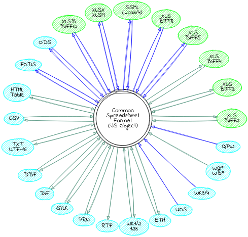
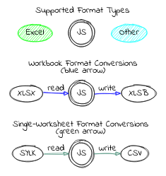

# [SheetJS](https://sheetjs.com)

The SheetJS Community Edition offers battle-tested open-source solutions for
extracting useful data from almost any complex spreadsheet and generating new
spreadsheets that will work with legacy and modern software alike.

[SheetJS Pro](https://sheetjs.com/pro) offers solutions beyond data processing:
Edit complex templates with ease; let out your inner Picasso with styling; make
custom sheets with images/graphs/PivotTables; evaluate formula expressions and
port calculations to web apps; automate common spreadsheet tasks, and much more!


[](https://github.com/SheetJS/sheetjs/actions)
[](https://snyk.io/test/github/SheetJS/sheetjs)
[](https://npmjs.org/package/xlsx)
[](https://www.jsdelivr.com/package/npm/xlsx)
[](https://github.com/SheetJS/sheetjs)

[**Browser Test and Support Matrix**](https://oss.sheetjs.com/sheetjs/tests/)

[](https://saucelabs.com/u/sheetjs)

**Supported File Formats**





## Table of Contents

<details>
  <summary><b>Expand to show Table of Contents</b></summary>

<!-- toc -->

- [Getting Started](#getting-started)
  * [Installation](#installation)
  * [Usage](#usage)
  * [The Zen of SheetJS](#the-zen-of-sheetjs)
  * [JS Ecosystem Demos](#js-ecosystem-demos)
- [Acquiring and Extracting Data](#acquiring-and-extracting-data)
  * [Parsing Workbooks](#parsing-workbooks)
  * [Processing JSON and JS Data](#processing-json-and-js-data)
  * [Processing HTML Tables](#processing-html-tables)
- [Processing Data](#processing-data)
  * [Modifying Workbook Structure](#modifying-workbook-structure)
  * [Modifying Cell Values](#modifying-cell-values)
  * [Modifying Other Worksheet / Workbook / Cell Properties](#modifying-other-worksheet--workbook--cell-properties)
- [Packaging and Releasing Data](#packaging-and-releasing-data)
  * [Writing Workbooks](#writing-workbooks)
  * [Writing Examples](#writing-examples)
  * [Streaming Write](#streaming-write)
  * [Generating JSON and JS Data](#generating-json-and-js-data)
  * [Generating HTML Tables](#generating-html-tables)
  * [Generating Single-Worksheet Snapshots](#generating-single-worksheet-snapshots)
- [Interface](#interface)
  * [Parsing functions](#parsing-functions)
  * [Writing functions](#writing-functions)
  * [Utilities](#utilities)
- [Common Spreadsheet Format](#common-spreadsheet-format)
  * [General Structures](#general-structures)
  * [Cell Object](#cell-object)
    + [Data Types](#data-types)
    + [Dates](#dates)
  * [Sheet Objects](#sheet-objects)
    + [Worksheet Object](#worksheet-object)
    + [Chartsheet Object](#chartsheet-object)
    + [Macrosheet Object](#macrosheet-object)
    + [Dialogsheet Object](#dialogsheet-object)
  * [Workbook Object](#workbook-object)
    + [Workbook File Properties](#workbook-file-properties)
  * [Workbook-Level Attributes](#workbook-level-attributes)
    + [Defined Names](#defined-names)
    + [Workbook Views](#workbook-views)
    + [Miscellaneous Workbook Properties](#miscellaneous-workbook-properties)
  * [Document Features](#document-features)
    + [Formulae](#formulae)
    + [Row and Column Properties](#row-and-column-properties)
    + [Number Formats](#number-formats)
    + [Hyperlinks](#hyperlinks)
    + [Cell Comments](#cell-comments)
    + [Sheet Visibility](#sheet-visibility)
    + [VBA and Macros](#vba-and-macros)
- [Parsing Options](#parsing-options)
  * [Input Type](#input-type)
  * [Guessing File Type](#guessing-file-type)
- [Writing Options](#writing-options)
  * [Supported Output Formats](#supported-output-formats)
  * [Output Type](#output-type)
- [Utility Functions](#utility-functions)
  * [Array of Arrays Input](#array-of-arrays-input)
  * [Array of Objects Input](#array-of-objects-input)
  * [HTML Table Input](#html-table-input)
  * [Formulae Output](#formulae-output)
  * [Delimiter-Separated Output](#delimiter-separated-output)
    + [UTF-16 Unicode Text](#utf-16-unicode-text)
  * [HTML Output](#html-output)
  * [JSON](#json)
- [File Formats](#file-formats)
- [Testing](#testing)
  * [Node](#node)
  * [Browser](#browser)
  * [Tested Environments](#tested-environments)
  * [Test Files](#test-files)
- [Contributing](#contributing)
  * [OSX/Linux](#osxlinux)
  * [Windows](#windows)
  * [Tests](#tests)
- [License](#license)
- [References](#references)

<!-- tocstop -->

</details>

## Getting Started

### Installation

**Standalone Browser Scripts**

The complete browser standalone build is saved to `dist/xlsx.full.min.js` and
can be directly added to a page with a `script` tag:

```html
<script lang="javascript" src="dist/xlsx.full.min.js"></script>
```

<details>
  <summary><b>CDN Availability</b> (click to show)</summary>

|    CDN     | URL                                        |
|-----------:|:-------------------------------------------|
|    `unpkg` | <https://unpkg.com/xlsx/>                  |
| `jsDelivr` | <https://jsdelivr.com/package/npm/xlsx>    |
|    `CDNjs` | <https://cdnjs.com/libraries/xlsx>         |
|    `packd` | <https://bundle.run/xlsx@latest?name=XLSX> |

For example, `unpkg` makes the latest version available at:

```html
<script src="https://unpkg.com/xlsx/dist/xlsx.full.min.js"></script>
```

</details>

<details>
  <summary><b>Browser builds</b> (click to show)</summary>

The complete single-file version is generated at `dist/xlsx.full.min.js`

`dist/xlsx.core.min.js` omits codepage library (no support for XLS encodings)

A slimmer build is generated at `dist/xlsx.mini.min.js`. Compared to full build:
- codepage library skipped (no support for XLS encodings)
- no support for XLSB / XLS / Lotus 1-2-3 / SpreadsheetML 2003 / Numbers
- node stream utils removed

</details>


With [bower](https://bower.io/search/?q=js-xlsx):

```bash
$ bower install js-xlsx
```

**ECMAScript Modules**

The ECMAScript Module build is saved to `xlsx.mjs` and can be directly added to
a page with a `script` tag using `type=module`:

```html
<script type="module">
import { read, writeFileXLSX } from "./xlsx.mjs";

/* load the codepage support library for extended support with older formats  */
import { set_cptable } from "./xlsx.mjs";
import * as cptable from './dist/cpexcel.full.mjs';
set_cptable(cptable);
</script>
```

The [npm package](https://www.npmjs.org/package/xlsx) also exposes the module
with the `module` parameter, supported in Angular and other projects:

```ts
import { read, writeFileXLSX } from "xlsx";

/* load the codepage support library for extended support with older formats  */
import { set_cptable } from "xlsx";
import * as cptable from 'xlsx/dist/cpexcel.full.mjs';
set_cptable(cptable);
```

**Deno**

The [`sheetjs`](https://deno.land/x/sheetjs) package is hosted by Deno:

```ts
// @deno-types="https://deno.land/x/sheetjs/types/index.d.ts"
import * as XLSX from 'https://deno.land/x/sheetjs/xlsx.mjs'

/* load the codepage support library for extended support with older formats  */
import * as cptable from 'https://deno.land/x/sheetjs/dist/cpexcel.full.mjs';
XLSX.set_cptable(cptable);
```

**NodeJS**

With [npm](https://www.npmjs.org/package/xlsx):

```bash
$ npm install xlsx
```

By default, the module supports `require`:

```js
var XLSX = require("xlsx");
```

The module also ships with `xlsx.mjs` for use with `import`:

```js
import * as XLSX from 'xlsx/xlsx.mjs';

/* load 'fs' for readFile and writeFile support */
import * as fs from 'fs';
XLSX.set_fs(fs);

/* load the codepage support library for extended support with older formats  */
import * as cpexcel from 'xlsx/dist/cpexcel.full.mjs';
XLSX.set_cptable(cpexcel);
```

**Photoshop and InDesign**

`dist/xlsx.extendscript.js` is an ExtendScript build for Photoshop and InDesign
that is included in the `npm` package.  It can be directly referenced with a
`#include` directive:

```extendscript
#include "xlsx.extendscript.js"
```


<details>
  <summary><b>Internet Explorer and ECMAScript 3 Compatibility</b> (click to show)</summary>

For broad compatibility with JavaScript engines, the library is written using
ECMAScript 3 language dialect as well as some ES5 features like `Array#forEach`.
Older browsers require shims to provide missing functions.

To use the shim, add the shim before the script tag that loads `xlsx.js`:

```html
<!-- add the shim first -->
<script type="text/javascript" src="shim.min.js"></script>
<!-- after the shim is referenced, add the library -->
<script type="text/javascript" src="xlsx.full.min.js"></script>
```

The script also includes `IE_LoadFile` and `IE_SaveFile` for loading and saving
files in Internet Explorer versions 6-9.  The `xlsx.extendscript.js` script
bundles the shim in a format suitable for Photoshop and other Adobe products.

</details>

### Usage

Most scenarios involving spreadsheets and data can be broken into 5 parts:

1) **Acquire Data**:  Data may be stored anywhere: local or remote files,
   databases, HTML TABLE, or even generated programmatically in the web browser.

2) **Extract Data**:  For spreadsheet files, this involves parsing raw bytes to
   read the cell data. For general JS data, this involves reshaping the data.

3) **Process Data**:  From generating summary statistics to cleaning data
   records, this step is the heart of the problem.

4) **Package Data**:  This can involve making a new spreadsheet or serializing
   with `JSON.stringify` or writing XML or simply flattening data for UI tools.

5) **Release Data**:  Spreadsheet files can be uploaded to a server or written
   locally.  Data can be presented to users in an HTML TABLE or data grid.

A common problem involves generating a valid spreadsheet export from data stored
in an HTML table.  In this example, an HTML TABLE on the page will be scraped,
a row will be added to the bottom with the date of the report, and a new file
will be generated and downloaded locally. `XLSX.writeFile` takes care of
packaging the data and attempting a local download:

```js
// Acquire Data (reference to the HTML table)
var table_elt = document.getElementById("my-table-id");

// Extract Data (create a workbook object from the table)
var workbook = XLSX.utils.table_to_book(table_elt);

// Process Data (add a new row)
var ws = workbook.Sheets["Sheet1"];
XLSX.utils.sheet_add_aoa(ws, [["Created "+new Date().toISOString()]], {origin:-1});

// Package and Release Data (`writeFile` tries to write and save an XLSB file)
XLSX.writeFile(workbook, "Report.xlsb");
```

This library tries to simplify steps 2 and 4 with functions to extract useful
data from spreadsheet files (`read` / `readFile`) and generate new spreadsheet
files from data (`write` / `writeFile`).  Additional utility functions like
`table_to_book` work with other common data sources like HTML tables.

This documentation and various demo projects cover a number of common scenarios
and approaches for steps 1 and 5.

Utility functions help with step 3.

["Acquiring and Extracting Data"](#acquiring-and-extracting-data) describes
solutions for common data import scenarios.

["Packaging and Releasing Data"](#packaging-and-releasing-data) describes
solutions for common data export scenarios.

["Processing Data"](#packaging-and-releasing-data) describes solutions for
common workbook processing and manipulation scenarios.

["Utility Functions"](#utility-functions) details utility functions for
translating JSON Arrays and other common JS structures into worksheet objects.

### The Zen of SheetJS

_Data processing should fit in any workflow_

The library does not impose a separate lifecycle.  It fits nicely in websites
and apps built using any framework.  The plain JS data objects play nice with
Web Workers and future APIs.

_JavaScript is a powerful language for data processing_

The ["Common Spreadsheet Format"](#common-spreadsheet-format) is a simple object
representation of the core concepts of a workbook.  The various functions in the
library provide low-level tools for working with the object.

For friendly JS processing, there are utility functions for converting parts of
a worksheet to/from an Array of Arrays.  The following example combines powerful
JS Array methods with a network request library to download data, select the
information we want and create a workbook file:

<details>
  <summary><b>Get Data from a JSON Endpoint and Generate a Workbook</b> (click to show)</summary>

The goal is to generate a XLSB workbook of US President names and birthdays.

**Acquire Data**

_Raw Data_

<https://theunitedstates.io/congress-legislators/executive.json> has the desired
data.  For example, John Adams:

```js
{
  "id": { /* (data omitted) */ },
  "name": {
    "first": "John",          // <-- first name
    "last": "Adams"           // <-- last name
  },
  "bio": {
    "birthday": "1735-10-19", // <-- birthday
    "gender": "M"
  },
  "terms": [
    { "type": "viceprez", /* (other fields omitted) */ },
    { "type": "viceprez", /* (other fields omitted) */ },
    { "type": "prez", /* (other fields omitted) */ } // <-- look for "prez"
  ]
}
```

_Filtering for Presidents_

The dataset includes Aaron Burr, a Vice President who was never President!

`Array#filter` creates a new array with the desired rows.  A President served
at least one term with `type` set to `"prez"`.  To test if a particular row has
at least one `"prez"` term, `Array#some` is another native JS function.  The
complete filter would be:

```js
const prez = raw_data.filter(row => row.terms.some(term => term.type === "prez"));
```

_Lining up the data_

For this example, the name will be the first name combined with the last name
(`row.name.first + " " + row.name.last`) and the birthday will be the subfield
`row.bio.birthday`.  Using `Array#map`, the dataset can be massaged in one call:

```js
const rows = prez.map(row => ({
  name: row.name.first + " " + row.name.last,
  birthday: row.bio.birthday
}));
```

The result is an array of "simple" objects with no nesting:

```js
[
  { name: "George Washington", birthday: "1732-02-22" },
  { name: "John Adams", birthday: "1735-10-19" },
  // ... one row per President
]
```

**Extract Data**

With the cleaned dataset, `XLSX.utils.json_to_sheet` generates a worksheet:

```js
const worksheet = XLSX.utils.json_to_sheet(rows);
```

`XLSX.utils.book_new` creates a new workbook and `XLSX.utils.book_append_sheet`
appends a worksheet to the workbook. The new worksheet will be called "Dates":

```js
const workbook = XLSX.utils.book_new();
XLSX.utils.book_append_sheet(workbook, worksheet, "Dates");
```

**Process Data**

_Fixing headers_

By default, `json_to_sheet` creates a worksheet with a header row. In this case,
the headers come from the JS object keys: "name" and "birthday".

The headers are in cells A1 and B1.  `XLSX.utils.sheet_add_aoa` can write text
values to the existing worksheet starting at cell A1:

```js
XLSX.utils.sheet_add_aoa(worksheet, [["Name", "Birthday"]], { origin: "A1" });
```

_Fixing Column Widths_

Some of the names are longer than the default column width.  Column widths are
set by [setting the `"!cols"` worksheet property](#row-and-column-properties).

The following line sets the width of column A to approximately 10 characters:

```js
worksheet["!cols"] = [ { wch: 10 } ]; // set column A width to 10 characters
```

One `Array#reduce` call over `rows` can calculate the maximum width:

```js
const max_width = rows.reduce((w, r) => Math.max(w, r.name.length), 10);
worksheet["!cols"] = [ { wch: max_width } ];
```

Note: If the starting point was a file or HTML table, `XLSX.utils.sheet_to_json`
will generate an array of JS objects.

**Package and Release Data**

`XLSX.writeFile` creates a spreadsheet file and tries to write it to the system.
In the browser, it will try to prompt the user to download the file.  In NodeJS,
it will write to the local directory.

```js
XLSX.writeFile(workbook, "Presidents.xlsx");
```

**Complete Example**

```js
// Uncomment the next line for use in NodeJS:
// const XLSX = require("xlsx"), axios = require("axios");

(async() => {
  /* fetch JSON data and parse */
  const url = "https://theunitedstates.io/congress-legislators/executive.json";
  const raw_data = (await axios(url, {responseType: "json"})).data;

  /* filter for the Presidents */
  const prez = raw_data.filter(row => row.terms.some(term => term.type === "prez"));

  /* flatten objects */
  const rows = prez.map(row => ({
    name: row.name.first + " " + row.name.last,
    birthday: row.bio.birthday
  }));

  /* generate worksheet and workbook */
  const worksheet = XLSX.utils.json_to_sheet(rows);
  const workbook = XLSX.utils.book_new();
  XLSX.utils.book_append_sheet(workbook, worksheet, "Dates");

  /* fix headers */
  XLSX.utils.sheet_add_aoa(worksheet, [["Name", "Birthday"]], { origin: "A1" });

  /* calculate column width */
  const max_width = rows.reduce((w, r) => Math.max(w, r.name.length), 10);
  worksheet["!cols"] = [ { wch: max_width } ];

  /* create an XLSX file and try to save to Presidents.xlsx */
  XLSX.writeFile(workbook, "Presidents.xlsx");
})();
```

For use in the web browser, assuming the snippet is saved to `snippet.js`,
script tags should be used to include the `axios` and `xlsx` standalone builds:

```html
<script src="https://unpkg.com/xlsx/dist/xlsx.full.min.js"></script>
<script src="https://unpkg.com/axios/dist/axios.min.js"></script>
<script src="snippet.js"></script>
```


</details>

_File formats are implementation details_

The parser covers a wide gamut of common spreadsheet file formats to ensure that
"HTML-saved-as-XLS" files work as well as actual XLS or XLSX files.

The writer supports a number of common output formats for broad compatibility
with the data ecosystem.

To the greatest extent possible, data processing code should not have to worry
about the specific file formats involved.


### JS Ecosystem Demos

The [`demos` directory](demos/) includes sample projects for:

**Frameworks and APIs**
- [`angularjs`](demos/angular/)
- [`angular and ionic`](demos/angular2/)
- [`knockout`](demos/knockout/)
- [`meteor`](demos/meteor/)
- [`react and react-native`](demos/react/)
- [`vue 2.x and weex`](demos/vue/)
- [`XMLHttpRequest and fetch`](demos/xhr/)
- [`nodejs server`](demos/server/)
- [`databases and key/value stores`](demos/database/)
- [`typed arrays and math`](demos/array/)

**Bundlers and Tooling**
- [`browserify`](demos/browserify/)
- [`fusebox`](demos/fusebox/)
- [`parcel`](demos/parcel/)
- [`requirejs`](demos/requirejs/)
- [`rollup`](demos/rollup/)
- [`systemjs`](demos/systemjs/)
- [`typescript`](demos/typescript/)
- [`webpack 2.x`](demos/webpack/)

**Platforms and Integrations**
- [`deno`](demos/deno/)
- [`electron application`](demos/electron/)
- [`nw.js application`](demos/nwjs/)
- [`Chrome / Chromium extensions`](demos/chrome/)
- [`Download a Google Sheet locally`](demos/google-sheet/)
- [`Adobe ExtendScript`](demos/extendscript/)
- [`Headless Browsers`](demos/headless/)
- [`canvas-datagrid`](demos/datagrid/)
- [`x-spreadsheet`](demos/xspreadsheet/)
- [`Swift JSC and other engines`](demos/altjs/)
- [`"serverless" functions`](demos/function/)
- [`internet explorer`](demos/oldie/)

Other examples are included in the [showcase](demos/showcase/).

<https://sheetjs.com/demos/modify.html> shows a complete example of reading,
modifying, and writing files.

<https://github.com/SheetJS/sheetjs/blob/HEAD/bin/xlsx.njs> is the command-line
tool included with node installations, reading spreadsheet files and exporting
the contents in various formats.
## Acquiring and Extracting Data

### Parsing Workbooks

**API**

_Extract data from spreadsheet bytes_

```js
var workbook = XLSX.read(data, opts);
```

The `read` method can extract data from spreadsheet bytes stored in a JS string,
"binary string", NodeJS buffer or typed array (`Uint8Array` or `ArrayBuffer`).


_Read spreadsheet bytes from a local file and extract data_

```js
var workbook = XLSX.readFile(filename, opts);
```

The `readFile` method attempts to read a spreadsheet file at the supplied path.
Browsers generally do not allow reading files in this way (it is deemed a
security risk), and attempts to read files in this way will throw an error.

The second `opts` argument is optional. ["Parsing Options"](#parsing-options)
covers the supported properties and behaviors.

**Examples**

Here are a few common scenarios (click on each subtitle to see the code):

<details>
  <summary><b>Local file in a NodeJS server</b> (click to show)</summary>

`readFile` uses `fs.readFileSync` under the hood:

```js
var XLSX = require("xlsx");

var workbook = XLSX.readFile("test.xlsx");
```

For Node ESM, the `readFile` helper is not enabled. Instead, `fs.readFileSync`
should be used to read the file data as a `Buffer` for use with `XLSX.read`:

```js
import { readFileSync } from "fs";
import { read } from "xlsx/xlsx.mjs";

const buf = readFileSync("test.xlsx");
/* buf is a Buffer */
const workbook = read(buf);
```

</details>

<details>
  <summary><b>Local file in a Deno application</b> (click to show)</summary>

`readFile` uses `Deno.readFileSync` under the hood:

```js
// @deno-types="https://deno.land/x/sheetjs/types/index.d.ts"
import * as XLSX from 'https://deno.land/x/sheetjs/xlsx.mjs'

const workbook = XLSX.readFile("test.xlsx");
```

Applications reading files must be invoked with the `--allow-read` flag.  The
[`deno` demo](demos/deno/) has more examples

</details>

<details>
  <summary><b>User-submitted file in a web page ("Drag-and-Drop")</b> (click to show)</summary>

For modern websites targeting Chrome 76+, `File#arrayBuffer` is recommended:

```js
// XLSX is a global from the standalone script

async function handleDropAsync(e) {
  e.stopPropagation(); e.preventDefault();
  const f = e.dataTransfer.files[0];
  /* f is a File */
  const data = await f.arrayBuffer();
  /* data is an ArrayBuffer */
  const workbook = XLSX.read(data);

  /* DO SOMETHING WITH workbook HERE */
}
drop_dom_element.addEventListener("drop", handleDropAsync, false);
```

For maximal compatibility, the `FileReader` API should be used:

```js
function handleDrop(e) {
  e.stopPropagation(); e.preventDefault();
  var f = e.dataTransfer.files[0];
  /* f is a File */
  var reader = new FileReader();
  reader.onload = function(e) {
    var data = e.target.result;
    /* reader.readAsArrayBuffer(file) -> data will be an ArrayBuffer */
    var workbook = XLSX.read(data);

    /* DO SOMETHING WITH workbook HERE */
  };
  reader.readAsArrayBuffer(f);
}
drop_dom_element.addEventListener("drop", handleDrop, false);
```

<https://oss.sheetjs.com/sheetjs/> demonstrates the FileReader technique.

</details>

<details>
  <summary><b>User-submitted file with an HTML INPUT element</b> (click to show)</summary>

Starting with an HTML INPUT element with `type="file"`:

```html
<input type="file" id="input_dom_element">
```

For modern websites targeting Chrome 76+, `Blob#arrayBuffer` is recommended:

```js
// XLSX is a global from the standalone script

async function handleFileAsync(e) {
  const file = e.target.files[0];
  const data = await file.arrayBuffer();
  /* data is an ArrayBuffer */
  const workbook = XLSX.read(data);

  /* DO SOMETHING WITH workbook HERE */
}
input_dom_element.addEventListener("change", handleFileAsync, false);
```

For broader support (including IE10+), the `FileReader` approach is recommended:

```js
function handleFile(e) {
  var file = e.target.files[0];
  var reader = new FileReader();
  reader.onload = function(e) {
    var data = e.target.result;
    /* reader.readAsArrayBuffer(file) -> data will be an ArrayBuffer */
    var workbook = XLSX.read(e.target.result);

    /* DO SOMETHING WITH workbook HERE */
  };
  reader.readAsArrayBuffer(file);
}
input_dom_element.addEventListener("change", handleFile, false);
```

The [`oldie` demo](demos/oldie/) shows an IE-compatible fallback scenario.

</details>

<details>
  <summary><b>Fetching a file in the web browser ("Ajax")</b> (click to show)</summary>

For modern websites targeting Chrome 42+, `fetch` is recommended:

```js
// XLSX is a global from the standalone script

(async() => {
  const url = "http://oss.sheetjs.com/test_files/formula_stress_test.xlsx";
  const data = await (await fetch(url)).arrayBuffer();
  /* data is an ArrayBuffer */
  const workbook = XLSX.read(data);

  /* DO SOMETHING WITH workbook HERE */
})();
```

For broader support, the `XMLHttpRequest` approach is recommended:

```js
var url = "http://oss.sheetjs.com/test_files/formula_stress_test.xlsx";

/* set up async GET request */
var req = new XMLHttpRequest();
req.open("GET", url, true);
req.responseType = "arraybuffer";

req.onload = function(e) {
  var workbook = XLSX.read(req.response);

  /* DO SOMETHING WITH workbook HERE */
};

req.send();
```

The [`xhr` demo](demos/xhr/) includes a longer discussion and more examples.

<http://oss.sheetjs.com/sheetjs/ajax.html> shows fallback approaches for IE6+.

</details>

<details>
  <summary><b>Local file in a PhotoShop or InDesign plugin</b> (click to show)</summary>

`readFile` wraps the `File` logic in Photoshop and other ExtendScript targets.
The specified path should be an absolute path:

```js
#include "xlsx.extendscript.js"

/* Read test.xlsx from the Documents folder */
var workbook = XLSX.readFile(Folder.myDocuments + "/test.xlsx");
```

The [`extendscript` demo](demos/extendscript/) includes a more complex example.

</details>

<details>
  <summary><b>Local file in an Electron app</b> (click to show)</summary>

`readFile` can be used in the renderer process:

```js
/* From the renderer process */
var XLSX = require("xlsx");

var workbook = XLSX.readFile(path);
```

Electron APIs have changed over time.  The [`electron` demo](demos/electron/)
shows a complete example and details the required version-specific settings.

</details>

<details>
  <summary><b>Local file in a mobile app with React Native</b> (click to show)</summary>

The [`react` demo](demos/react) includes a sample React Native app.

Since React Native does not provide a way to read files from the filesystem, a
third-party library must be used.  The following libraries have been tested:

- [`react-native-file-access`](https://npm.im/react-native-file-access)

The `base64` encoding returns strings compatible with the `base64` type:

```js
import XLSX from "xlsx";
import { FileSystem } from "react-native-file-access";

const b64 = await FileSystem.readFile(path, "base64");
/* b64 is a base64 string */
const workbook = XLSX.read(b64, {type: "base64"});
```

- [`react-native-fs`](https://npm.im/react-native-fs)

The `ascii` encoding returns binary strings compatible with the `binary` type:

```js
import XLSX from "xlsx";
import { readFile } from "react-native-fs";

const bstr = await readFile(path, "ascii");
/* bstr is a binary string */
const workbook = XLSX.read(bstr, {type: "binary"});
```

</details>

<details>
  <summary><b>NodeJS Server File Uploads</b> (click to show)</summary>

`read` can accept a NodeJS buffer.  `readFile` can read files generated by a
HTTP POST request body parser like [`formidable`](https://npm.im/formidable):

```js
const XLSX = require("xlsx");
const http = require("http");
const formidable = require("formidable");

const server = http.createServer((req, res) => {
  const form = new formidable.IncomingForm();
  form.parse(req, (err, fields, files) => {
    /* grab the first file */
    const f = Object.entries(files)[0][1];
    const path = f.filepath;
    const workbook = XLSX.readFile(path);

    /* DO SOMETHING WITH workbook HERE */
  });
}).listen(process.env.PORT || 7262);
```

The [`server` demo](demos/server) has more advanced examples.

</details>

<details>
  <summary><b>Download files in a NodeJS process</b> (click to show)</summary>

Node 17.5 and 18.0 have native support for fetch:

```js
const XLSX = require("xlsx");

const data = await (await fetch(url)).arrayBuffer();
/* data is an ArrayBuffer */
const workbook = XLSX.read(data);
```

For broader compatibility, third-party modules are recommended.

[`request`](https://npm.im/request) requires a `null` encoding to yield Buffers:

```js
var XLSX = require("xlsx");
var request = require("request");

request({url: url, encoding: null}, function(err, resp, body) {
  var workbook = XLSX.read(body);

  /* DO SOMETHING WITH workbook HERE */
});
```

[`axios`](https://npm.im/axios) works the same way in browser and in NodeJS:

```js
const XLSX = require("xlsx");
const axios = require("axios");

(async() => {
  const res = await axios.get(url, {responseType: "arraybuffer"});
  /* res.data is a Buffer */
  const workbook = XLSX.read(res.data);

  /* DO SOMETHING WITH workbook HERE */
})();
```

</details>

<details>
  <summary><b>Download files in an Electron app</b> (click to show)</summary>

The `net` module in the main process can make HTTP/HTTPS requests to external
resources.  Responses should be manually concatenated using `Buffer.concat`:

```js
const XLSX = require("xlsx");
const { net } = require("electron");

const req = net.request(url);
req.on("response", (res) => {
  const bufs = []; // this array will collect all of the buffers
  res.on("data", (chunk) => { bufs.push(chunk); });
  res.on("end", () => {
    const workbook = XLSX.read(Buffer.concat(bufs));

    /* DO SOMETHING WITH workbook HERE */
  });
});
req.end();
```

</details>

<details>
  <summary><b>Readable Streams in NodeJS</b> (click to show)</summary>

When dealing with Readable Streams, the easiest approach is to buffer the stream
and process the whole thing at the end:

```js
var fs = require("fs");
var XLSX = require("xlsx");

function process_RS(stream, cb) {
  var buffers = [];
  stream.on("data", function(data) { buffers.push(data); });
  stream.on("end", function() {
    var buffer = Buffer.concat(buffers);
    var workbook = XLSX.read(buffer, {type:"buffer"});

    /* DO SOMETHING WITH workbook IN THE CALLBACK */
    cb(workbook);
  });
}
```

</details>

<details>
  <summary><b>ReadableStream in the browser</b> (click to show)</summary>

When dealing with `ReadableStream`, the easiest approach is to buffer the stream
and process the whole thing at the end:

```js
// XLSX is a global from the standalone script

async function process_RS(stream) {
  /* collect data */
  const buffers = [];
  const reader = stream.getReader();
  for(;;) {
    const res = await reader.read();
    if(res.value) buffers.push(res.value);
    if(res.done) break;
  }

  /* concat */
  const out = new Uint8Array(buffers.reduce((acc, v) => acc + v.length, 0));

  let off = 0;
  for(const u8 of arr) {
    out.set(u8, off);
    off += u8.length;
  }

  return out;
}

const data = await process_RS(stream);
/* data is Uint8Array */
const workbook = XLSX.read(data);
```

</details>

More detailed examples are covered in the [included demos](demos/)

### Processing JSON and JS Data

JSON and JS data tend to represent single worksheets.  This section will use a
few utility functions to generate workbooks.

_Create a new Workbook_

```js
var workbook = XLSX.utils.book_new();
```

The `book_new` utility function creates an empty workbook with no worksheets.

Spreadsheet software generally require at least one worksheet and enforce the
requirement in the user interface.  This library enforces the requirement at
write time, throwing errors if an empty workbook is passed to write functions.


**API**

_Create a worksheet from an array of arrays of JS values_

```js
var worksheet = XLSX.utils.aoa_to_sheet(aoa, opts);
```

The `aoa_to_sheet` utility function walks an "array of arrays" in row-major
order, generating a worksheet object.  The following snippet generates a sheet
with cell `A1` set to the string `A1`, cell `B1` set to `B1`, etc:

```js
var worksheet = XLSX.utils.aoa_to_sheet([
  ["A1", "B1", "C1"],
  ["A2", "B2", "C2"],
  ["A3", "B3", "C3"]
]);
```

["Array of Arrays Input"](#array-of-arrays-input) describes the function and the
optional `opts` argument in more detail.


_Create a worksheet from an array of JS objects_

```js
var worksheet = XLSX.utils.json_to_sheet(jsa, opts);
```

The `json_to_sheet` utility function walks an array of JS objects in order,
generating a worksheet object.  By default, it will generate a header row and
one row per object in the array.  The optional `opts` argument has settings to
control the column order and header output.

["Array of Objects Input"](#array-of-arrays-input) describes the function and
the optional `opts` argument in more detail.

**Examples**

["Zen of SheetJS"](#the-zen-of-sheetjs) contains a detailed example "Get Data
from a JSON Endpoint and Generate a Workbook"


[`x-spreadsheet`](https://github.com/myliang/x-spreadsheet) is an interactive
data grid for previewing and modifying structured data in the web browser.  The
[`xspreadsheet` demo](/demos/xspreadsheet) includes a sample script with the
`xtos` function for converting from x-spreadsheet data object to a workbook.
<https://oss.sheetjs.com/sheetjs/x-spreadsheet> is a live demo.

<details>
  <summary><b>Records from a database query (SQL or no-SQL)</b> (click to show)</summary>

The [`database` demo](/demos/database/) includes examples of working with
databases and query results.

</details>


<details>
  <summary><b>Numerical Computations with TensorFlow.js</b> (click to show)</summary>

[`@tensorflow/tfjs`](@tensorflow/tfjs) and other libraries expect data in simple
arrays, well-suited for worksheets where each column is a data vector.  That is
the transpose of how most people use spreadsheets, where each row is a vector.

When recovering data from `tfjs`, the returned data points are stored in a typed
array.  An array of arrays can be constructed with loops. `Array#unshift` can
prepend a title row before the conversion:

```js
const XLSX = require("xlsx");
const tf = require('@tensorflow/tfjs');

/* suppose xs and ys are vectors (1D tensors) -> tfarr will be a typed array */
const tfdata = tf.stack([xs, ys]).transpose();
const shape = tfdata.shape;
const tfarr = tfdata.dataSync();

/* construct the array of arrays */
const aoa = [];
for(let j = 0; j < shape[0]; ++j) {
  aoa[j] = [];
  for(let i = 0; i < shape[1]; ++i) aoa[j][i] = tfarr[j * shape[1] + i];
}
/* add headers to the top */
aoa.unshift(["x", "y"]);

/* generate worksheet */
const worksheet = XLSX.utils.aoa_to_sheet(aoa);
```

The [`array` demo](demos/array/) shows a complete example.

</details>


### Processing HTML Tables

**API**

_Create a worksheet by scraping an HTML TABLE in the page_

```js
var worksheet = XLSX.utils.table_to_sheet(dom_element, opts);
```

The `table_to_sheet` utility function takes a DOM TABLE element and iterates
through the rows to generate a worksheet.  The `opts` argument is optional.
["HTML Table Input"](#html-table-input) describes the function in more detail.


_Create a workbook by scraping an HTML TABLE in the page_

```js
var workbook = XLSX.utils.table_to_book(dom_element, opts);
```

The `table_to_book` utility function follows the same logic as `table_to_sheet`.
After generating a worksheet, it creates a blank workbook and appends the
spreadsheet.

The options argument supports the same options as `table_to_sheet`, with the
addition of a `sheet` property to control the worksheet name.  If the property
is missing or no options are specified, the default name `Sheet1` is used.

**Examples**

Here are a few common scenarios (click on each subtitle to see the code):

<details>
  <summary><b>HTML TABLE element in a webpage</b> (click to show)</summary>

```html
<!-- include the standalone script and shim.  this uses the UNPKG CDN -->
<script src="https://unpkg.com/xlsx/dist/shim.min.js"></script>
<script src="https://unpkg.com/xlsx/dist/xlsx.full.min.js"></script>

<!-- example table with id attribute -->
<table id="tableau">
  <tr><td>Sheet</td><td>JS</td></tr>
  <tr><td>12345</td><td>67</td></tr>
</table>

<!-- this block should appear after the table HTML and the standalone script -->
<script type="text/javascript">
  var workbook = XLSX.utils.table_to_book(document.getElementById("tableau"));

  /* DO SOMETHING WITH workbook HERE */
</script>
```

Multiple tables on a web page can be converted to individual worksheets:

```js
/* create new workbook */
var workbook = XLSX.utils.book_new();

/* convert table "table1" to worksheet named "Sheet1" */
var sheet1 = XLSX.utils.table_to_sheet(document.getElementById("table1"));
XLSX.utils.book_append_sheet(workbook, sheet1, "Sheet1");

/* convert table "table2" to worksheet named "Sheet2" */
var sheet2 = XLSX.utils.table_to_sheet(document.getElementById("table2"));
XLSX.utils.book_append_sheet(workbook, sheet2, "Sheet2");

/* workbook now has 2 worksheets */
```

Alternatively, the HTML code can be extracted and parsed:

```js
var htmlstr = document.getElementById("tableau").outerHTML;
var workbook = XLSX.read(htmlstr, {type:"string"});
```

</details>

<details>
  <summary><b>Chrome/Chromium Extension</b> (click to show)</summary>

The [`chrome` demo](demos/chrome/) shows a complete example and details the
required permissions and other settings.

In an extension, it is recommended to generate the workbook in a content script
and pass the object back to the extension:

```js
/* in the worker script */
chrome.runtime.onMessage.addListener(function(msg, sender, cb) {
  /* pass a message like { sheetjs: true } from the extension to scrape */
  if(!msg || !msg.sheetjs) return;
  /* create a new workbook */
  var workbook = XLSX.utils.book_new();
  /* loop through each table element */
  var tables = document.getElementsByTagName("table")
  for(var i = 0; i < tables.length; ++i) {
    var worksheet = XLSX.utils.table_to_sheet(tables[i]);
    XLSX.utils.book_append_sheet(workbook, worksheet, "Table" + i);
  }
  /* pass back to the extension */
  return cb(workbook);
});
```

</details>

<details>
  <summary><b>Server-Side HTML Tables with Headless Chrome</b> (click to show)</summary>

The [`headless` demo](demos/headless/) includes a complete demo to convert HTML
files to XLSB workbooks.  The core idea is to add the script to the page, parse
the table in the page context, generate a `base64` workbook and send it back
for further processing:

```js
const XLSX = require("xlsx");
const { readFileSync } = require("fs"), puppeteer = require("puppeteer");

const url = `https://sheetjs.com/demos/table`;

/* get the standalone build source (node_modules/xlsx/dist/xlsx.full.min.js) */
const lib = readFileSync(require.resolve("xlsx/dist/xlsx.full.min.js"), "utf8");

(async() => {
  /* start browser and go to web page */
  const browser = await puppeteer.launch();
  const page = await browser.newPage();
  await page.goto(url, {waitUntil: "networkidle2"});

  /* inject library */
  await page.addScriptTag({content: lib});

  /* this function `s5s` will be called by the script below, receiving the Base64-encoded file */
  await page.exposeFunction("s5s", async(b64) => {
    const workbook = XLSX.read(b64, {type: "base64" });

    /* DO SOMETHING WITH workbook HERE */
  });

  /* generate XLSB file in webpage context and send back result */
  await page.addScriptTag({content: `
    /* call table_to_book on first table */
    var workbook = XLSX.utils.table_to_book(document.querySelector("TABLE"));

    /* generate XLSX file */
    var b64 = XLSX.write(workbook, {type: "base64", bookType: "xlsb"});

    /* call "s5s" hook exposed from the node process */
    window.s5s(b64);
  `});

  /* cleanup */
  await browser.close();
})();
```

</details>

<details>
  <summary><b>Server-Side HTML Tables with Headless WebKit</b> (click to show)</summary>

The [`headless` demo](demos/headless/) includes a complete demo to convert HTML
files to XLSB workbooks using [PhantomJS](https://phantomjs.org/). The core idea
is to add the script to the page, parse the table in the page context, generate
a `binary` workbook and send it back for further processing:

```js
var XLSX = require('xlsx');
var page = require('webpage').create();

/* this code will be run in the page */
var code = [ "function(){",
  /* call table_to_book on first table */
  "var wb = XLSX.utils.table_to_book(document.body.getElementsByTagName('table')[0]);",

  /* generate XLSB file and return binary string */
  "return XLSX.write(wb, {type: 'binary', bookType: 'xlsb'});",
"}" ].join("");

page.open('https://sheetjs.com/demos/table', function() {
  /* Load the browser script from the UNPKG CDN */
  page.includeJs("https://unpkg.com/xlsx/dist/xlsx.full.min.js", function() {
    /* The code will return an XLSB file encoded as binary string */
    var bin = page.evaluateJavaScript(code);

    var workbook = XLSX.read(bin, {type: "binary"});
    /* DO SOMETHING WITH workbook HERE */

    phantom.exit();
  });
});
```

</details>

<details>
  <summary><b>NodeJS HTML Tables without a browser</b> (click to show)</summary>

NodeJS does not include a DOM implementation and Puppeteer requires a hefty
Chromium build.  [`jsdom`](https://npm.im/jsdom) is a lightweight alternative:

```js
const XLSX = require("xlsx");
const { readFileSync } = require("fs");
const { JSDOM } = require("jsdom");

/* obtain HTML string.  This example reads from test.html */
const html_str = fs.readFileSync("test.html", "utf8");
/* get first TABLE element */
const doc = new JSDOM(html_str).window.document.querySelector("table");
/* generate workbook */
const workbook = XLSX.utils.table_to_book(doc);
```

</details>

## Processing Data

The ["Common Spreadsheet Format"](#common-spreadsheet-format) is a simple object
representation of the core concepts of a workbook.  The utility functions work
with the object representation and are intended to handle common use cases.

### Modifying Workbook Structure

**API**

_Append a Worksheet to a Workbook_

```js
XLSX.utils.book_append_sheet(workbook, worksheet, sheet_name);
```

The `book_append_sheet` utility function appends a worksheet to the workbook.
The third argument specifies the desired worksheet name. Multiple worksheets can
be added to a workbook by calling the function multiple times.

_List the Worksheet names in tab order_

```js
var wsnames = workbook.SheetNames;
```

The `SheetNames` property of the workbook object is a list of the worksheet
names in "tab order".  API functions will look at this array.

_Replace a Worksheet in place_

```js
workbook.Sheets[sheet_name] = new_worksheet;
```

The `Sheets` property of the workbook object is an object whose keys are names
and whose values are worksheet objects.  By reassigning to a property of the
`Sheets` object, the worksheet object can be changed without disrupting the
rest of the worksheet structure.

**Examples**

<details>
  <summary><b>Add a new worksheet to a workbook</b> (click to show)</summary>

This example uses [`XLSX.utils.aoa_to_sheet`](#array-of-arrays-input).

```js
var ws_name = "SheetJS";

/* Create worksheet */
var ws_data = [
  [ "S", "h", "e", "e", "t", "J", "S" ],
  [  1 ,  2 ,  3 ,  4 ,  5 ]
];
var ws = XLSX.utils.aoa_to_sheet(ws_data);

/* Add the worksheet to the workbook */
XLSX.utils.book_append_sheet(wb, ws, ws_name);
```

</details>

### Modifying Cell Values

**API**

_Modify a single cell value in a worksheet_

```js
XLSX.utils.sheet_add_aoa(worksheet, [[new_value]], { origin: address });
```

_Modify multiple cell values in a worksheet_

```js
XLSX.utils.sheet_add_aoa(worksheet, aoa, opts);
```

The `sheet_add_aoa` utility function modifies cell values in a worksheet.  The
first argument is the worksheet object.  The second argument is an array of
arrays of values.  The `origin` key of the third argument controls where cells
will be written.  The following snippet sets `B3=1` and `E5="abc"`:

```js
XLSX.utils.sheet_add_aoa(worksheet, [
  [1],                             // <-- Write 1 to cell B3
  ,                                // <-- Do nothing in row 4
  [/*B5*/, /*C5*/, /*D5*/, "abc"]  // <-- Write "abc" to cell E5
], { origin: "B3" });
```

["Array of Arrays Input"](#array-of-arrays-input) describes the function and the
optional `opts` argument in more detail.

**Examples**

<details>
  <summary><b>Appending rows to a worksheet</b> (click to show)</summary>

The special origin value `-1` instructs `sheet_add_aoa` to start in column A of
the row after the last row in the range, appending the data:

```js
XLSX.utils.sheet_add_aoa(worksheet, [
  ["first row after data", 1],
  ["second row after data", 2]
], { origin: -1 });
```

</details>


### Modifying Other Worksheet / Workbook / Cell Properties

The ["Common Spreadsheet Format"](#common-spreadsheet-format) section describes
the object structures in greater detail.

## Packaging and Releasing Data

### Writing Workbooks

**API**

_Generate spreadsheet bytes (file) from data_

```js
var data = XLSX.write(workbook, opts);
```

The `write` method attempts to package data from the workbook into a file in
memory.  By default, XLSX files are generated, but that can be controlled with
the `bookType` property of the `opts` argument.  Based on the `type` option,
the data can be stored as a "binary string", JS string, `Uint8Array` or Buffer.

The second `opts` argument is required.  ["Writing Options"](#writing-options)
covers the supported properties and behaviors.

_Generate and attempt to save file_

```js
XLSX.writeFile(workbook, filename, opts);
```

The `writeFile` method packages the data and attempts to save the new file.  The
export file format is determined by the extension of `filename` (`SheetJS.xlsx`
signals XLSX export, `SheetJS.xlsb` signals XLSB export, etc).

The `writeFile` method uses platform-specific APIs to initiate the file save. In
NodeJS, `fs.readFileSync` can create a file.  In the web browser, a download is
attempted using the HTML5 `download` attribute, with fallbacks for IE.

_Generate and attempt to save an XLSX file_

```js
XLSX.writeFileXLSX(workbook, filename, opts);
```

The `writeFile` method embeds a number of different export functions.  This is
great for developer experience but not amenable to tree shaking using the
current developer tools.  When only XLSX exports are needed, this method avoids
referencing the other export functions.

The second `opts` argument is optional.  ["Writing Options"](#writing-options)
covers the supported properties and behaviors.

**Examples**

<details>
  <summary><b>Local file in a NodeJS server</b> (click to show)</summary>

`writeFile` uses `fs.writeFileSync` in server environments:

```js
var XLSX = require("xlsx");

/* output format determined by filename */
XLSX.writeFile(workbook, "out.xlsb");
```

For Node ESM, the `writeFile` helper is not enabled. Instead, `fs.writeFileSync`
should be used to write the file data to a `Buffer` for use with `XLSX.write`:

```js
import { writeFileSync } from "fs";
import { write } from "xlsx/xlsx.mjs";

const buf = write(workbook, {type: "buffer", bookType: "xlsb"});
/* buf is a Buffer */
const workbook = writeFileSync("out.xlsb", buf);
```

</details>

<details>
  <summary><b>Local file in a Deno application</b> (click to show)</summary>

`writeFile` uses `Deno.writeFileSync` under the hood:

```js
// @deno-types="https://deno.land/x/sheetjs/types/index.d.ts"
import * as XLSX from 'https://deno.land/x/sheetjs/xlsx.mjs'

XLSX.writeFile(workbook, "test.xlsx");
```

Applications writing files must be invoked with the `--allow-write` flag.  The
[`deno` demo](demos/deno/) has more examples

</details>

<details>
  <summary><b>Local file in a PhotoShop or InDesign plugin</b> (click to show)</summary>

`writeFile` wraps the `File` logic in Photoshop and other ExtendScript targets.
The specified path should be an absolute path:

```js
#include "xlsx.extendscript.js"

/* output format determined by filename */
XLSX.writeFile(workbook, "out.xlsx");
/* at this point, out.xlsx is a file that you can distribute */
```

The [`extendscript` demo](demos/extendscript/) includes a more complex example.

</details>

<details>
  <summary><b>Download a file in the browser to the user machine</b> (click to show)</summary>

`XLSX.writeFile` wraps a few techniques for triggering a file save:

- `URL` browser API creates an object URL for the file, which the library uses
  by creating a link and forcing a click. It is supported in modern browsers.
- `msSaveBlob` is an IE10+ API for triggering a file save.
- `IE_FileSave` uses VBScript and ActiveX to write a file in IE6+ for Windows
  XP and Windows 7.  The shim must be included in the containing HTML page.

There is no standard way to determine if the actual file has been downloaded.

```js
/* output format determined by filename */
XLSX.writeFile(workbook, "out.xlsb");
/* at this point, out.xlsb will have been downloaded */
```

</details>

<details>
  <summary><b>Download a file in legacy browsers</b> (click to show)</summary>

`XLSX.writeFile` techniques work for most modern browsers as well as older IE.
For much older browsers, there are workarounds implemented by wrapper libraries.

[`FileSaver.js`](https://github.com/eligrey/FileSaver.js/) implements `saveAs`.
Note: `XLSX.writeFile` will automatically call `saveAs` if available.

```js
/* bookType can be any supported output type */
var wopts = { bookType:"xlsx", bookSST:false, type:"array" };

var wbout = XLSX.write(workbook,wopts);

/* the saveAs call downloads a file on the local machine */
saveAs(new Blob([wbout],{type:"application/octet-stream"}), "test.xlsx");
```

[`Downloadify`](https://github.com/dcneiner/downloadify) uses a Flash SWF button
to generate local files, suitable for environments where ActiveX is unavailable:

```js
Downloadify.create(id,{
  /* other options are required! read the downloadify docs for more info */
  filename: "test.xlsx",
  data: function() { return XLSX.write(wb, {bookType:"xlsx", type:"base64"}); },
  append: false,
  dataType: "base64"
});
```

The [`oldie` demo](demos/oldie/) shows an IE-compatible fallback scenario.

</details>

<details>
  <summary><b>Browser upload file (ajax)</b> (click to show)</summary>

A complete example using XHR is [included in the XHR demo](demos/xhr/), along
with examples for fetch and wrapper libraries.  This example assumes the server
can handle Base64-encoded files (see the demo for a basic nodejs server):

```js
/* in this example, send a base64 string to the server */
var wopts = { bookType:"xlsx", bookSST:false, type:"base64" };

var wbout = XLSX.write(workbook,wopts);

var req = new XMLHttpRequest();
req.open("POST", "/upload", true);
var formdata = new FormData();
formdata.append("file", "test.xlsx"); // <-- server expects `file` to hold name
formdata.append("data", wbout); // <-- `data` holds the base64-encoded data
req.send(formdata);
```

</details>

<details>
  <summary><b>PhantomJS (Headless Webkit) File Generation</b> (click to show)</summary>

The [`headless` demo](demos/headless/) includes a complete demo to convert HTML
files to XLSB workbooks using [PhantomJS](https://phantomjs.org/). PhantomJS
`fs.write` supports writing files from the main process but has a different
interface from the NodeJS `fs` module:

```js
var XLSX = require('xlsx');
var fs = require('fs');

/* generate a binary string */
var bin = XLSX.write(workbook, { type:"binary", bookType: "xlsx" });
/* write to file */
fs.write("test.xlsx", bin, "wb");
```

Note: The section ["Processing HTML Tables"](#processing-html-tables) shows how
to generate a workbook from HTML tables in a page in "Headless WebKit".

</details>


The [included demos](demos/) cover mobile apps and other special deployments.

### Writing Examples

- <http://sheetjs.com/demos/table.html> exporting an HTML table
- <http://sheetjs.com/demos/writexlsx.html> generates a simple file

### Streaming Write

The streaming write functions are available in the `XLSX.stream` object.  They
take the same arguments as the normal write functions but return a Readable
Stream.  They are only exposed in NodeJS.

- `XLSX.stream.to_csv` is the streaming version of `XLSX.utils.sheet_to_csv`.
- `XLSX.stream.to_html` is the streaming version of `XLSX.utils.sheet_to_html`.
- `XLSX.stream.to_json` is the streaming version of `XLSX.utils.sheet_to_json`.

<details>
  <summary><b>nodejs convert to CSV and write file</b> (click to show)</summary>

```js
var output_file_name = "out.csv";
var stream = XLSX.stream.to_csv(worksheet);
stream.pipe(fs.createWriteStream(output_file_name));
```

</details>

<details>
  <summary><b>nodejs write JSON stream to screen</b> (click to show)</summary>

```js
/* to_json returns an object-mode stream */
var stream = XLSX.stream.to_json(worksheet, {raw:true});

/* the following stream converts JS objects to text via JSON.stringify */
var conv = new Transform({writableObjectMode:true});
conv._transform = function(obj, e, cb){ cb(null, JSON.stringify(obj) + "\n"); };

stream.pipe(conv); conv.pipe(process.stdout);
```

</details>

<https://github.com/sheetjs/sheetaki> pipes write streams to nodejs response.

### Generating JSON and JS Data

JSON and JS data tend to represent single worksheets. The utility functions in
this section work with single worksheets.

The ["Common Spreadsheet Format"](#common-spreadsheet-format) section describes
the object structure in more detail.  `workbook.SheetNames` is an ordered list
of the worksheet names.  `workbook.Sheets` is an object whose keys are sheet
names and whose values are worksheet objects.

The "first worksheet" is stored at `workbook.Sheets[workbook.SheetNames[0]]`.

**API**

_Create an array of JS objects from a worksheet_

```js
var jsa = XLSX.utils.sheet_to_json(worksheet, opts);
```

_Create an array of arrays of JS values from a worksheet_

```js
var aoa = XLSX.utils.sheet_to_json(worksheet, {...opts, header: 1});
```

The `sheet_to_json` utility function walks a workbook in row-major order,
generating an array of objects.  The second `opts` argument controls a number of
export decisions including the type of values (JS values or formatted text). The
["JSON"](#json) section describes the argument in more detail.

By default, `sheet_to_json` scans the first row and uses the values as headers.
With the `header: 1` option, the function exports an array of arrays of values.

**Examples**

[`x-spreadsheet`](https://github.com/myliang/x-spreadsheet) is an interactive
data grid for previewing and modifying structured data in the web browser.  The
[`xspreadsheet` demo](/demos/xspreadsheet) includes a sample script with the
`stox` function for converting from a workbook to x-spreadsheet data object.
<https://oss.sheetjs.com/sheetjs/x-spreadsheet> is a live demo.

<details>
  <summary><b>Previewing data in a React data grid</b> (click to show)</summary>

[`react-data-grid`](https://npm.im/react-data-grid) is a data grid tailored for
react.  It expects two properties: `rows` of data objects and `columns` which
describe the columns.  For the purposes of massaging the data to fit the react
data grid API it is easiest to start from an array of arrays.

This demo starts by fetching a remote file and using `XLSX.read` to extract:

```js
import { useEffect, useState } from "react";
import DataGrid from "react-data-grid";
import { read, utils } from "xlsx";

const url = "https://oss.sheetjs.com/test_files/RkNumber.xls";

export default function App() {
  const [columns, setColumns] = useState([]);
  const [rows, setRows] = useState([]);
  useEffect(() => {(async () => {
    const wb = read(await (await fetch(url)).arrayBuffer(), { WTF: 1 });

    /* use sheet_to_json with header: 1 to generate an array of arrays */
    const data = utils.sheet_to_json(wb.Sheets[wb.SheetNames[0]], { header: 1 });

    /* see react-data-grid docs to understand the shape of the expected data */
    setColumns(data[0].map((r) => ({ key: r, name: r })));
    setRows(data.slice(1).map((r) => r.reduce((acc, x, i) => {
      acc[data[0][i]] = x;
      return acc;
    }, {})));
  })(); });

  return <DataGrid columns={columns} rows={rows} />;
}
```

</details>

<details>
  <summary><b>Populating a database (SQL or no-SQL)</b> (click to show)</summary>

The [`database` demo](/demos/database/) includes examples of working with
databases and query results.

</details>

<details>
  <summary><b>Numerical Computations with TensorFlow.js</b> (click to show)</summary>

[`@tensorflow/tfjs`](@tensorflow/tfjs) and other libraries expect data in simple
arrays, well-suited for worksheets where each column is a data vector.  That is
the transpose of how most people use spreadsheets, where each row is a vector.

A single `Array#map` can pull individual named rows from `sheet_to_json` export:

```js
const XLSX = require("xlsx");
const tf = require('@tensorflow/tfjs');

const key = "age"; // this is the field we want to pull
const ages = XLSX.utils.sheet_to_json(worksheet).map(r => r[key]);
const tf_data = tf.tensor1d(ages);
```

All fields can be processed at once using a transpose of the 2D tensor generated
with the `sheet_to_json` export with `header: 1`. The first row, if it contains
header labels, should be removed with a slice:

```js
const XLSX = require("xlsx");
const tf = require('@tensorflow/tfjs');

/* array of arrays of the data starting on the second row */
const aoa = XLSX.utils.sheet_to_json(worksheet, {header: 1}).slice(1);
/* dataset in the "correct orientation" */
const tf_dataset = tf.tensor2d(aoa).transpose();
/* pull out each dataset with a slice */
const tf_field0 = tf_dataset.slice([0,0], [1,tensor.shape[1]]).flatten();
const tf_field1 = tf_dataset.slice([1,0], [1,tensor.shape[1]]).flatten();
```

The [`array` demo](demos/array/) shows a complete example.

</details>


### Generating HTML Tables

**API**

_Generate HTML Table from Worksheet_

```js
var html = XLSX.utils.sheet_to_html(worksheet);
```

The `sheet_to_html` utility function generates HTML code based on the worksheet
data.  Each cell in the worksheet is mapped to a `<TD>` element.  Merged cells
in the worksheet are serialized by setting `colspan` and `rowspan` attributes.

**Examples**

The `sheet_to_html` utility function generates HTML code that can be added to
any DOM element by setting the `innerHTML`:

```js
var container = document.getElementById("tavolo");
container.innerHTML = XLSX.utils.sheet_to_html(worksheet);
```

Combining with `fetch`, constructing a site from a workbook is straightforward:

<details>
  <summary><b>Vanilla JS + HTML fetch workbook and generate table previews</b> (click to show)</summary>

```html
<body>
  <style>TABLE { border-collapse: collapse; } TD { border: 1px solid; }</style>
  <div id="tavolo"></div>
  <script src="https://unpkg.com/xlsx/dist/xlsx.full.min.js"></script>
  <script type="text/javascript">
(async() => {
  /* fetch and parse workbook -- see the fetch example for details */
  const workbook = XLSX.read(await (await fetch("sheetjs.xlsx")).arrayBuffer());

  let output = [];
  /* loop through the worksheet names in order */
  workbook.SheetNames.forEach(name => {

    /* generate HTML from the corresponding worksheets */
    const worksheet = workbook.Sheets[name];
    const html = XLSX.utils.sheet_to_html(worksheet);

    /* add a header with the title name followed by the table */
    output.push(`<H3>${name}</H3>${html}`);
  });
  /* write to the DOM at the end */
  tavolo.innerHTML = output.join("\n");
})();
  </script>
</body>
```

</details>

<details>
  <summary><b>React fetch workbook and generate HTML table previews</b> (click to show)</summary>

It is generally recommended to use a React-friendly workflow, but it is possible
to generate HTML and use it in React with `dangerouslySetInnerHTML`:

```jsx
function Tabeller(props) {
  /* the workbook object is the state */
  const [workbook, setWorkbook] = React.useState(XLSX.utils.book_new());

  /* fetch and update the workbook with an effect */
  React.useEffect(() => { (async() => {
    /* fetch and parse workbook -- see the fetch example for details */
    const wb = XLSX.read(await (await fetch("sheetjs.xlsx")).arrayBuffer());
    setWorkbook(wb);
  })(); });

  return workbook.SheetNames.map(name => (<>
    <h3>name</h3>
    <div dangerouslySetInnerHTML={{
      /* this __html mantra is needed to set the inner HTML */
      __html: XLSX.utils.sheet_to_html(workbook.Sheets[name])
    }} />
  </>));
}
```

The [`react` demo](demos/react) includes more React examples.

</details>

<details>
  <summary><b>VueJS fetch workbook and generate HTML table previews</b> (click to show)</summary>

It is generally recommended to use a VueJS-friendly workflow, but it is possible
to generate HTML and use it in VueJS with the `v-html` directive:

```jsx
import { read, utils } from 'xlsx';
import { reactive } from 'vue';

const S5SComponent = {
  mounted() { (async() => {
    /* fetch and parse workbook -- see the fetch example for details */
    const workbook = read(await (await fetch("sheetjs.xlsx")).arrayBuffer());
    /* loop through the worksheet names in order */
    workbook.SheetNames.forEach(name => {
      /* generate HTML from the corresponding worksheets */
      const html = utils.sheet_to_html(workbook.Sheets[name]);
      /* add to state */
      this.wb.wb.push({ name, html });
    });
  })(); },
  /* this state mantra is required for array updates to work */
  setup() { return { wb: reactive({ wb: [] }) }; },
  template: `
  <div v-for="ws in wb.wb" :key="ws.name">
    <h3>{{ ws.name }}</h3>
    <div v-html="ws.html"></div>
  </div>`
};
```

The [`vuejs` demo](demos/vue) includes more React examples.

</details>

### Generating Single-Worksheet Snapshots

The `sheet_to_*` functions accept a worksheet object.

**API**

_Generate a CSV from a single worksheet_

```js
var csv = XLSX.utils.sheet_to_csv(worksheet, opts);
```

This snapshot is designed to replicate the "CSV UTF8 (`.csv`)" output type.
["Delimiter-Separated Output"](#delimiter-separated-output) describes the
function and the optional `opts` argument in more detail.

_Generate "Text" from a single worksheet_

```js
var txt = XLSX.utils.sheet_to_txt(worksheet, opts);
```

This snapshot is designed to replicate the "UTF16 Text (`.txt`)" output type.
["Delimiter-Separated Output"](#delimiter-separated-output) describes the
function and the optional `opts` argument in more detail.

_Generate a list of formulae from a single worksheet_

```js
var fmla = XLSX.utils.sheet_to_formulae(worksheet);
```

This snapshot generates an array of entries representing the embedded formulae.
Array formulae are rendered in the form `range=formula` while plain cells are
rendered in the form `cell=formula or value`.  String literals are prefixed with
an apostrophe `'`, consistent with Excel's formula bar display.

["Formulae Output"](#formulae-output) describes the function in more detail.

## Interface

`XLSX` is the exposed variable in the browser and the exported node variable

`XLSX.version` is the version of the library (added by the build script).

`XLSX.SSF` is an embedded version of the [format library](https://git.io/ssf).

### Parsing functions

`XLSX.read(data, read_opts)` attempts to parse `data`.

`XLSX.readFile(filename, read_opts)` attempts to read `filename` and parse.

Parse options are described in the [Parsing Options](#parsing-options) section.

### Writing functions

`XLSX.write(wb, write_opts)` attempts to write the workbook `wb`

`XLSX.writeFile(wb, filename, write_opts)` attempts to write `wb` to `filename`.
In browser-based environments, it will attempt to force a client-side download.

`XLSX.writeFileAsync(wb, filename, o, cb)` attempts to write `wb` to `filename`.
If `o` is omitted, the writer will use the third argument as the callback.

`XLSX.stream` contains a set of streaming write functions.

Write options are described in the [Writing Options](#writing-options) section.

### Utilities

Utilities are available in the `XLSX.utils` object and are described in the
[Utility Functions](#utility-functions) section:

**Constructing:**

- `book_new` creates an empty workbook
- `book_append_sheet` adds a worksheet to a workbook

**Importing:**

- `aoa_to_sheet` converts an array of arrays of JS data to a worksheet.
- `json_to_sheet` converts an array of JS objects to a worksheet.
- `table_to_sheet` converts a DOM TABLE element to a worksheet.
- `sheet_add_aoa` adds an array of arrays of JS data to an existing worksheet.
- `sheet_add_json` adds an array of JS objects to an existing worksheet.


**Exporting:**

- `sheet_to_json` converts a worksheet object to an array of JSON objects.
- `sheet_to_csv` generates delimiter-separated-values output.
- `sheet_to_txt` generates UTF16 formatted text.
- `sheet_to_html` generates HTML output.
- `sheet_to_formulae` generates a list of the formulae (with value fallbacks).


**Cell and cell address manipulation:**

- `format_cell` generates the text value for a cell (using number formats).
- `encode_row / decode_row` converts between 0-indexed rows and 1-indexed rows.
- `encode_col / decode_col` converts between 0-indexed columns and column names.
- `encode_cell / decode_cell` converts cell addresses.
- `encode_range / decode_range` converts cell ranges.

## Common Spreadsheet Format

SheetJS conforms to the Common Spreadsheet Format (CSF):

### General Structures

Cell address objects are stored as `{c:C, r:R}` where `C` and `R` are 0-indexed
column and row numbers, respectively.  For example, the cell address `B5` is
represented by the object `{c:1, r:4}`.

Cell range objects are stored as `{s:S, e:E}` where `S` is the first cell and
`E` is the last cell in the range.  The ranges are inclusive.  For example, the
range `A3:B7` is represented by the object `{s:{c:0, r:2}, e:{c:1, r:6}}`.
Utility functions perform a row-major order walk traversal of a sheet range:

```js
for(var R = range.s.r; R <= range.e.r; ++R) {
  for(var C = range.s.c; C <= range.e.c; ++C) {
    var cell_address = {c:C, r:R};
    /* if an A1-style address is needed, encode the address */
    var cell_ref = XLSX.utils.encode_cell(cell_address);
  }
}
```

### Cell Object

Cell objects are plain JS objects with keys and values following the convention:

| Key | Description                                                            |
| --- | ---------------------------------------------------------------------- |
| `v` | raw value (see Data Types section for more info)                       |
| `w` | formatted text (if applicable)                                         |
| `t` | type: `b` Boolean, `e` Error, `n` Number, `d` Date, `s` Text, `z` Stub |
| `f` | cell formula encoded as an A1-style string (if applicable)             |
| `F` | range of enclosing array if formula is array formula (if applicable)   |
| `D` | if true, array formula is dynamic (if applicable)                      |
| `r` | rich text encoding (if applicable)                                     |
| `h` | HTML rendering of the rich text (if applicable)                        |
| `c` | comments associated with the cell                                      |
| `z` | number format string associated with the cell (if requested)           |
| `l` | cell hyperlink object (`.Target` holds link, `.Tooltip` is tooltip)    |
| `s` | the style/theme of the cell (if applicable)                            |

Built-in export utilities (such as the CSV exporter) will use the `w` text if it
is available.  To change a value, be sure to delete `cell.w` (or set it to
`undefined`) before attempting to export.  The utilities will regenerate the `w`
text from the number format (`cell.z`) and the raw value if possible.

The actual array formula is stored in the `f` field of the first cell in the
array range.  Other cells in the range will omit the `f` field.

#### Data Types

The raw value is stored in the `v` value property, interpreted based on the `t`
type property.  This separation allows for representation of numbers as well as
numeric text.  There are 6 valid cell types:

| Type | Description                                                           |
| :--: | :-------------------------------------------------------------------- |
| `b`  | Boolean: value interpreted as JS `boolean`                            |
| `e`  | Error: value is a numeric code and `w` property stores common name ** |
| `n`  | Number: value is a JS `number` **                                     |
| `d`  | Date: value is a JS `Date` object or string to be parsed as Date **   |
| `s`  | Text: value interpreted as JS `string` and written as text **         |
| `z`  | Stub: blank stub cell that is ignored by data processing utilities ** |

<details>
  <summary><b>Error values and interpretation</b> (click to show)</summary>

|  Value | Error Meaning   |
| -----: | :-------------- |
| `0x00` | `#NULL!`        |
| `0x07` | `#DIV/0!`       |
| `0x0F` | `#VALUE!`       |
| `0x17` | `#REF!`         |
| `0x1D` | `#NAME?`        |
| `0x24` | `#NUM!`         |
| `0x2A` | `#N/A`          |
| `0x2B` | `#GETTING_DATA` |

</details>

Type `n` is the Number type. This includes all forms of data that Excel stores
as numbers, such as dates/times and Boolean fields.  Excel exclusively uses data
that can be fit in an IEEE754 floating point number, just like JS Number, so the
`v` field holds the raw number.  The `w` field holds formatted text.  Dates are
stored as numbers by default and converted with `XLSX.SSF.parse_date_code`.

Type `d` is the Date type, generated only when the option `cellDates` is passed.
Since JSON does not have a natural Date type, parsers are generally expected to
store ISO 8601 Date strings like you would get from `date.toISOString()`.  On
the other hand, writers and exporters should be able to handle date strings and
JS Date objects.  Note that Excel disregards timezone modifiers and treats all
dates in the local timezone.  The library does not correct for this error.

Type `s` is the String type.  Values are explicitly stored as text.  Excel will
interpret these cells as "number stored as text".  Generated Excel files
automatically suppress that class of error, but other formats may elicit errors.

Type `z` represents blank stub cells.  They are generated in cases where cells
have no assigned value but hold comments or other metadata. They are ignored by
the core library data processing utility functions.  By default these cells are
not generated; the parser `sheetStubs` option must be set to `true`.


#### Dates

<details>
  <summary><b>Excel Date Code details</b> (click to show)</summary>

By default, Excel stores dates as numbers with a format code that specifies date
processing.  For example, the date `19-Feb-17` is stored as the number `42785`
with a number format of `d-mmm-yy`.  The `SSF` module understands number formats
and performs the appropriate conversion.

XLSX also supports a special date type `d` where the data is an ISO 8601 date
string.  The formatter converts the date back to a number.

The default behavior for all parsers is to generate number cells.  Setting
`cellDates` to true will force the generators to store dates.

</details>

<details>
  <summary><b>Time Zones and Dates</b> (click to show)</summary>

Excel has no native concept of universal time.  All times are specified in the
local time zone.  Excel limitations prevent specifying true absolute dates.

Following Excel, this library treats all dates as relative to local time zone.

</details>

<details>
  <summary><b>Epochs: 1900 and 1904</b> (click to show)</summary>

Excel supports two epochs (January 1 1900 and January 1 1904).
The workbook's epoch can be determined by examining the workbook's
`wb.Workbook.WBProps.date1904` property:

```js
!!(((wb.Workbook||{}).WBProps||{}).date1904)
```

</details>

### Sheet Objects

Each key that does not start with `!` maps to a cell (using `A-1` notation)

`sheet[address]` returns the cell object for the specified address.

**Special sheet keys (accessible as `sheet[key]`, each starting with `!`):**

- `sheet['!ref']`: A-1 based range representing the sheet range. Functions that
  work with sheets should use this parameter to determine the range.  Cells that
  are assigned outside of the range are not processed.  In particular, when
  writing a sheet by hand, cells outside of the range are not included

  Functions that handle sheets should test for the presence of `!ref` field.
  If the `!ref` is omitted or is not a valid range, functions are free to treat
  the sheet as empty or attempt to guess the range.  The standard utilities that
  ship with this library treat sheets as empty (for example, the CSV output is
  empty string).

  When reading a worksheet with the `sheetRows` property set, the ref parameter
  will use the restricted range.  The original range is set at `ws['!fullref']`

- `sheet['!margins']`: Object representing the page margins.  The default values
  follow Excel's "normal" preset.  Excel also has a "wide" and a "narrow" preset
  but they are stored as raw measurements. The main properties are listed below:

<details>
  <summary><b>Page margin details</b> (click to show)</summary>

| key      | description            | "normal" | "wide" | "narrow" |
|----------|------------------------|:---------|:-------|:-------- |
| `left`   | left margin (inches)   | `0.7`    | `1.0`  | `0.25`   |
| `right`  | right margin (inches)  | `0.7`    | `1.0`  | `0.25`   |
| `top`    | top margin (inches)    | `0.75`   | `1.0`  | `0.75`   |
| `bottom` | bottom margin (inches) | `0.75`   | `1.0`  | `0.75`   |
| `header` | header margin (inches) | `0.3`    | `0.5`  | `0.3`    |
| `footer` | footer margin (inches) | `0.3`    | `0.5`  | `0.3`    |

```js
/* Set worksheet sheet to "normal" */
ws["!margins"]={left:0.7, right:0.7, top:0.75,bottom:0.75,header:0.3,footer:0.3}
/* Set worksheet sheet to "wide" */
ws["!margins"]={left:1.0, right:1.0, top:1.0, bottom:1.0, header:0.5,footer:0.5}
/* Set worksheet sheet to "narrow" */
ws["!margins"]={left:0.25,right:0.25,top:0.75,bottom:0.75,header:0.3,footer:0.3}
```
</details>

#### Worksheet Object

In addition to the base sheet keys, worksheets also add:

- `ws['!cols']`: array of column properties objects.  Column widths are actually
  stored in files in a normalized manner, measured in terms of the "Maximum
  Digit Width" (the largest width of the rendered digits 0-9, in pixels).  When
  parsed, the column objects store the pixel width in the `wpx` field, character
  width in the `wch` field, and the maximum digit width in the `MDW` field.

- `ws['!rows']`: array of row properties objects as explained later in the docs.
  Each row object encodes properties including row height and visibility.

- `ws['!merges']`: array of range objects corresponding to the merged cells in
  the worksheet.  Plain text formats do not support merge cells.  CSV export
  will write all cells in the merge range if they exist, so be sure that only
  the first cell (upper-left) in the range is set.

- `ws['!outline']`: configure how outlines should behave.  Options default to
  the default settings in Excel 2019:

| key       | Excel feature                                 | default |
|:----------|:----------------------------------------------|:--------|
| `above`   | Uncheck "Summary rows below detail"           | `false` |
| `left`    | Uncheck "Summary rows to the right of detail" | `false` |

- `ws['!protect']`: object of write sheet protection properties.  The `password`
  key specifies the password for formats that support password-protected sheets
  (XLSX/XLSB/XLS).  The writer uses the XOR obfuscation method.  The following
  keys control the sheet protection -- set to `false` to enable a feature when
  sheet is locked or set to `true` to disable a feature:

<details>
  <summary><b>Worksheet Protection Details</b> (click to show)</summary>

| key                   | feature (true=disabled / false=enabled) | default    |
|:----------------------|:----------------------------------------|:-----------|
| `selectLockedCells`   | Select locked cells                     | enabled    |
| `selectUnlockedCells` | Select unlocked cells                   | enabled    |
| `formatCells`         | Format cells                            | disabled   |
| `formatColumns`       | Format columns                          | disabled   |
| `formatRows`          | Format rows                             | disabled   |
| `insertColumns`       | Insert columns                          | disabled   |
| `insertRows`          | Insert rows                             | disabled   |
| `insertHyperlinks`    | Insert hyperlinks                       | disabled   |
| `deleteColumns`       | Delete columns                          | disabled   |
| `deleteRows`          | Delete rows                             | disabled   |
| `sort`                | Sort                                    | disabled   |
| `autoFilter`          | Filter                                  | disabled   |
| `pivotTables`         | Use PivotTable reports                  | disabled   |
| `objects`             | Edit objects                            | enabled    |
| `scenarios`           | Edit scenarios                          | enabled    |
</details>

- `ws['!autofilter']`: AutoFilter object following the schema:

```typescript
type AutoFilter = {
  ref:string; // A-1 based range representing the AutoFilter table range
}
```

#### Chartsheet Object

Chartsheets are represented as standard sheets.  They are distinguished with the
`!type` property set to `"chart"`.

The underlying data and `!ref` refer to the cached data in the chartsheet.  The
first row of the chartsheet is the underlying header.

#### Macrosheet Object

Macrosheets are represented as standard sheets.  They are distinguished with the
`!type` property set to `"macro"`.

#### Dialogsheet Object

Dialogsheets are represented as standard sheets. They are distinguished with the
`!type` property set to `"dialog"`.

### Workbook Object

`workbook.SheetNames` is an ordered list of the sheets in the workbook

`wb.Sheets[sheetname]` returns an object representing the worksheet.

`wb.Props` is an object storing the standard properties.  `wb.Custprops` stores
custom properties.  Since the XLS standard properties deviate from the XLSX
standard, XLS parsing stores core properties in both places.

`wb.Workbook` stores [workbook-level attributes](#workbook-level-attributes).

#### Workbook File Properties

The various file formats use different internal names for file properties.  The
workbook `Props` object normalizes the names:

<details>
  <summary><b>File Properties</b> (click to show)</summary>

| JS Name       | Excel Description              |
|:--------------|:-------------------------------|
| `Title`       | Summary tab "Title"            |
| `Subject`     | Summary tab "Subject"          |
| `Author`      | Summary tab "Author"           |
| `Manager`     | Summary tab "Manager"          |
| `Company`     | Summary tab "Company"          |
| `Category`    | Summary tab "Category"         |
| `Keywords`    | Summary tab "Keywords"         |
| `Comments`    | Summary tab "Comments"         |
| `LastAuthor`  | Statistics tab "Last saved by" |
| `CreatedDate` | Statistics tab "Created"       |

</details>

For example, to set the workbook title property:

```js
if(!wb.Props) wb.Props = {};
wb.Props.Title = "Insert Title Here";
```

Custom properties are added in the workbook `Custprops` object:

```js
if(!wb.Custprops) wb.Custprops = {};
wb.Custprops["Custom Property"] = "Custom Value";
```

Writers will process the `Props` key of the options object:

```js
/* force the Author to be "SheetJS" */
XLSX.write(wb, {Props:{Author:"SheetJS"}});
```

### Workbook-Level Attributes

`wb.Workbook` stores workbook-level attributes.

#### Defined Names

`wb.Workbook.Names` is an array of defined name objects which have the keys:

<details>
  <summary><b>Defined Name Properties</b> (click to show)</summary>

| Key       | Description                                                      |
|:----------|:-----------------------------------------------------------------|
| `Sheet`   | Name scope.  Sheet Index (0 = first sheet) or `null` (Workbook)  |
| `Name`    | Case-sensitive name.  Standard rules apply **                    |
| `Ref`     | A1-style Reference (`"Sheet1!$A$1:$D$20"`)                       |
| `Comment` | Comment (only applicable for XLS/XLSX/XLSB)                      |

</details>

Excel allows two sheet-scoped defined names to share the same name.  However, a
sheet-scoped name cannot collide with a workbook-scope name.  Workbook writers
may not enforce this constraint.

#### Workbook Views

`wb.Workbook.Views` is an array of workbook view objects which have the keys:

| Key             | Description                                         |
|:----------------|:----------------------------------------------------|
| `RTL`           | If true, display right-to-left                      |

#### Miscellaneous Workbook Properties

`wb.Workbook.WBProps` holds other workbook properties:

| Key             | Description                                         |
|:----------------|:----------------------------------------------------|
| `CodeName`      | [VBA Project Workbook Code Name](#vba-and-macros)   |
| `date1904`      | epoch: 0/false for 1900 system, 1/true for 1904     |
| `filterPrivacy` | Warn or strip personally identifying info on save   |

### Document Features

Even for basic features like date storage, the official Excel formats store the
same content in different ways.  The parsers are expected to convert from the
underlying file format representation to the Common Spreadsheet Format.  Writers
are expected to convert from CSF back to the underlying file format.

#### Formulae

The A1-style formula string is stored in the `f` field.  Even though different
file formats store the formulae in different ways, the formats are translated.
Even though some formats store formulae with a leading equal sign, CSF formulae
do not start with `=`.

<details>
  <summary><b>Formulae File Format Support</b> (click to show)</summary>

| Storage Representation | Formats                  | Read  | Write |
|:-----------------------|:-------------------------|:-----:|:-----:|
| A1-style strings       | XLSX                     |   ✔   |   ✔   |
| RC-style strings       | XLML and plain text      |   ✔   |   ✔   |
| BIFF Parsed formulae   | XLSB and all XLS formats |   ✔   |       |
| OpenFormula formulae   | ODS/FODS/UOS             |   ✔   |   ✔   |
| Lotus Parsed formulae  | All Lotus WK_ formats    |   ✔   |       |

Since Excel prohibits named cells from colliding with names of A1 or RC style
cell references, a (not-so-simple) regex conversion is possible.  BIFF Parsed
formulae and Lotus Parsed formulae have to be explicitly unwound.  OpenFormula
formulae can be converted with regular expressions.

Shared formulae are decompressed and each cell has the formula corresponding to
its cell.  Writers generally do not attempt to generate shared formulae.
</details>

**Single-Cell Formulae**

For simple formulae, the `f` key of the desired cell can be set to the actual
formula text.  This worksheet represents `A1=1`, `A2=2`, and `A3=A1+A2`:

```js
var worksheet = {
  "!ref": "A1:A3",
  A1: { t:'n', v:1 },
  A2: { t:'n', v:2 },
  A3: { t:'n', v:3, f:'A1+A2' }
};
```

Utilities like `aoa_to_sheet` will accept cell objects in lieu of values:

```js
var worksheet = XLSX.utils.aoa_to_sheet([
  [ 1 ], // A1
  [ 2 ], // A2
  [ {t: "n", v: 3, f: "A1+A2"} ] // A3
]);
```

Cells with formula entries but no value will be serialized in a way that Excel
and other spreadsheet tools will recognize.  This library will not automatically
compute formula results!  For example, the following worksheet will include the
`BESSELJ` function but the result will not be available in JavaScript:

```js
var worksheet = XLSX.utils.aoa_to_sheet([
  [ 3.14159, 2 ], // Row "1"
  [ { t:'n', f:'BESSELJ(A1,B1)' } ] // Row "2" will be calculated on file open
}
```

If the actual results are needed in JS, [SheetJS Pro](https://sheetjs.com/pro)
offers a formula calculator component for evaluating expressions, updating
values and dependent cells, and refreshing entire workbooks.


**Array Formulae**

_Assign an array formula_

```js
XLSX.utils.sheet_set_array_formula(worksheet, range, formula);
```

Array formulae are stored in the top-left cell of the array block.  All cells
of an array formula have a `F` field corresponding to the range.  A single-cell
formula can be distinguished from a plain formula by the presence of `F` field.

For example, setting the cell `C1` to the array formula `{=SUM(A1:A3*B1:B3)}`:

```js
// API function
XLSX.utils.sheet_set_array_formula(worksheet, "C1", "SUM(A1:A3*B1:B3)");

// ... OR raw operations
worksheet['C1'] = { t:'n', f: "SUM(A1:A3*B1:B3)", F:"C1:C1" };
```

For a multi-cell array formula, every cell has the same array range but only the
first cell specifies the formula.  Consider `D1:D3=A1:A3*B1:B3`:

```js
// API function
XLSX.utils.sheet_set_array_formula(worksheet, "D1:D3", "A1:A3*B1:B3");

// ... OR raw operations
worksheet['D1'] = { t:'n', F:"D1:D3", f:"A1:A3*B1:B3" };
worksheet['D2'] = { t:'n', F:"D1:D3" };
worksheet['D3'] = { t:'n', F:"D1:D3" };
```

Utilities and writers are expected to check for the presence of a `F` field and
ignore any possible formula element `f` in cells other than the starting cell.
They are not expected to perform validation of the formulae!


**Dynamic Array Formulae**

_Assign a dynamic array formula_

```js
XLSX.utils.sheet_set_array_formula(worksheet, range, formula, true);
```

Released in 2020, Dynamic Array Formulae are supported in the XLSX/XLSM and XLSB
file formats.  They are represented like normal array formulae but have special
cell metadata indicating that the formula should be allowed to adjust the range.

An array formula can be marked as dynamic by setting the cell's `D` property to
true.  The `F` range is expected but can be the set to the current cell:

```js
// API function
XLSX.utils.sheet_set_array_formula(worksheet, "C1", "_xlfn.UNIQUE(A1:A3)", 1);

// ... OR raw operations
worksheet['C1'] = { t: "s", f: "_xlfn.UNIQUE(A1:A3)", F:"C1", D: 1 }; // dynamic
```

**Localization with Function Names**

SheetJS operates at the file level.  Excel stores formula expressions using the
English (United States) function names.  For non-English users, Excel uses a
localized set of function names.

For example, when the computer language and region is set to French (France),
Excel interprets `=SOMME(A1:C3)` as if `SOMME` is the `SUM` function.  However,
in the actual file, Excel stores `SUM(A1:C3)`.

**Prefixed "Future Functions"**

Functions introduced in newer versions of Excel are prefixed with `_xlfn.` when
stored in files.  When writing formula expressions using these functions, the
prefix is required for maximal compatibility:

```js
// Broadest compatibility
XLSX.utils.sheet_set_array_formula(worksheet, "C1", "_xlfn.UNIQUE(A1:A3)", 1);

// Can cause errors in spreadsheet software
XLSX.utils.sheet_set_array_formula(worksheet, "C1", "UNIQUE(A1:A3)", 1);
```

When reading a file, the `xlfn` option preserves the prefixes.

<details>
  <summary><b> Functions requiring `_xlfn.` prefix</b> (click to show)</summary>

This list is growing with each Excel release.

```
ACOT
ACOTH
AGGREGATE
ARABIC
BASE
BETA.DIST
BETA.INV
BINOM.DIST
BINOM.DIST.RANGE
BINOM.INV
BITAND
BITLSHIFT
BITOR
BITRSHIFT
BITXOR
BYCOL
BYROW
CEILING.MATH
CEILING.PRECISE
CHISQ.DIST
CHISQ.DIST.RT
CHISQ.INV
CHISQ.INV.RT
CHISQ.TEST
COMBINA
CONFIDENCE.NORM
CONFIDENCE.T
COT
COTH
COVARIANCE.P
COVARIANCE.S
CSC
CSCH
DAYS
DECIMAL
ERF.PRECISE
ERFC.PRECISE
EXPON.DIST
F.DIST
F.DIST.RT
F.INV
F.INV.RT
F.TEST
FIELDVALUE
FILTERXML
FLOOR.MATH
FLOOR.PRECISE
FORMULATEXT
GAMMA
GAMMA.DIST
GAMMA.INV
GAMMALN.PRECISE
GAUSS
HYPGEOM.DIST
IFNA
IMCOSH
IMCOT
IMCSC
IMCSCH
IMSEC
IMSECH
IMSINH
IMTAN
ISFORMULA
ISOMITTED
ISOWEEKNUM
LAMBDA
LET
LOGNORM.DIST
LOGNORM.INV
MAKEARRAY
MAP
MODE.MULT
MODE.SNGL
MUNIT
NEGBINOM.DIST
NORM.DIST
NORM.INV
NORM.S.DIST
NORM.S.INV
NUMBERVALUE
PDURATION
PERCENTILE.EXC
PERCENTILE.INC
PERCENTRANK.EXC
PERCENTRANK.INC
PERMUTATIONA
PHI
POISSON.DIST
QUARTILE.EXC
QUARTILE.INC
QUERYSTRING
RANDARRAY
RANK.AVG
RANK.EQ
REDUCE
RRI
SCAN
SEC
SECH
SEQUENCE
SHEET
SHEETS
SKEW.P
SORTBY
STDEV.P
STDEV.S
T.DIST
T.DIST.2T
T.DIST.RT
T.INV
T.INV.2T
T.TEST
UNICHAR
UNICODE
UNIQUE
VAR.P
VAR.S
WEBSERVICE
WEIBULL.DIST
XLOOKUP
XOR
Z.TEST
```

</details>

#### Row and Column Properties

<details>
  <summary><b>Format Support</b> (click to show)</summary>

**Row Properties**: XLSX/M, XLSB, BIFF8 XLS, XLML, SYLK, DOM, ODS

**Column Properties**: XLSX/M, XLSB, BIFF8 XLS, XLML, SYLK, DOM

</details>


Row and Column properties are not extracted by default when reading from a file
and are not persisted by default when writing to a file. The option
`cellStyles: true` must be passed to the relevant read or write function.

_Column Properties_

The `!cols` array in each worksheet, if present, is a collection of `ColInfo`
objects which have the following properties:

```typescript
type ColInfo = {
  /* visibility */
  hidden?: boolean; // if true, the column is hidden

  /* column width is specified in one of the following ways: */
  wpx?:    number;  // width in screen pixels
  width?:  number;  // width in Excel's "Max Digit Width", width*256 is integral
  wch?:    number;  // width in characters

  /* other fields for preserving features from files */
  level?:  number;  // 0-indexed outline / group level
  MDW?:    number;  // Excel's "Max Digit Width" unit, always integral
};
```

_Row Properties_

The `!rows` array in each worksheet, if present, is a collection of `RowInfo`
objects which have the following properties:

```typescript
type RowInfo = {
  /* visibility */
  hidden?: boolean; // if true, the row is hidden

  /* row height is specified in one of the following ways: */
  hpx?:    number;  // height in screen pixels
  hpt?:    number;  // height in points

  level?:  number;  // 0-indexed outline / group level
};
```

_Outline / Group Levels Convention_

The Excel UI displays the base outline level as `1` and the max level as `8`.
Following JS conventions, SheetJS uses 0-indexed outline levels wherein the base
outline level is `0` and the max level is `7`.

<details>
  <summary><b>Why are there three width types?</b> (click to show)</summary>

There are three different width types corresponding to the three different ways
spreadsheets store column widths:

SYLK and other plain text formats use raw character count. Contemporaneous tools
like Visicalc and Multiplan were character based.  Since the characters had the
same width, it sufficed to store a count.  This tradition was continued into the
BIFF formats.

SpreadsheetML (2003) tried to align with HTML by standardizing on screen pixel
count throughout the file.  Column widths, row heights, and other measures use
pixels.  When the pixel and character counts do not align, Excel rounds values.

XLSX internally stores column widths in a nebulous "Max Digit Width" form.  The
Max Digit Width is the width of the largest digit when rendered (generally the
"0" character is the widest).  The internal width must be an integer multiple of
the the width divided by 256.  ECMA-376 describes a formula for converting
between pixels and the internal width.  This represents a hybrid approach.

Read functions attempt to populate all three properties.  Write functions will
try to cycle specified values to the desired type.  In order to avoid potential
conflicts, manipulation should delete the other properties first.  For example,
when changing the pixel width, delete the `wch` and `width` properties.
</details>

<details>
  <summary><b>Implementation details</b> (click to show)</summary>

_Row Heights_

Excel internally stores row heights in points.  The default resolution is 72 DPI
or 96 PPI, so the pixel and point size should agree.  For different resolutions
they may not agree, so the library separates the concepts.

Even though all of the information is made available, writers are expected to
follow the priority order:

1) use `hpx` pixel height if available
2) use `hpt` point height if available

_Column Widths_

Given the constraints, it is possible to determine the MDW without actually
inspecting the font!  The parsers guess the pixel width by converting from width
to pixels and back, repeating for all possible MDW and selecting the MDW that
minimizes the error.  XLML actually stores the pixel width, so the guess works
in the opposite direction.

Even though all of the information is made available, writers are expected to
follow the priority order:

1) use `width` field if available
2) use `wpx` pixel width if available
3) use `wch` character count if available

</details>

#### Number Formats

The `cell.w` formatted text for each cell is produced from `cell.v` and `cell.z`
format.  If the format is not specified, the Excel `General` format is used.
The format can either be specified as a string or as an index into the format
table.  Parsers are expected to populate `workbook.SSF` with the number format
table.  Writers are expected to serialize the table.

Custom tools should ensure that the local table has each used format string
somewhere in the table.  Excel convention mandates that the custom formats start
at index 164.  The following example creates a custom format from scratch:

<details>
  <summary><b>New worksheet with custom format</b> (click to show)</summary>

```js
var wb = {
  SheetNames: ["Sheet1"],
  Sheets: {
    Sheet1: {
      "!ref":"A1:C1",
      A1: { t:"n", v:10000 },                    // <-- General format
      B1: { t:"n", v:10000, z: "0%" },           // <-- Builtin format
      C1: { t:"n", v:10000, z: "\"T\"\ #0.00" }  // <-- Custom format
    }
  }
}
```
</details>

The rules are slightly different from how Excel displays custom number formats.
In particular, literal characters must be wrapped in double quotes or preceded
by a backslash. For more info, see the Excel documentation article
`Create or delete a custom number format` or ECMA-376 18.8.31 (Number Formats)


<details>
  <summary><b>Default Number Formats</b> (click to show)</summary>

The default formats are listed in ECMA-376 18.8.30:

| ID | Format                     |
|---:|:---------------------------|
|  0 | `General`                  |
|  1 | `0`                        |
|  2 | `0.00`                     |
|  3 | `#,##0`                    |
|  4 | `#,##0.00`                 |
|  9 | `0%`                       |
| 10 | `0.00%`                    |
| 11 | `0.00E+00`                 |
| 12 | `# ?/?`                    |
| 13 | `# ??/??`                  |
| 14 | `m/d/yy` (see below)       |
| 15 | `d-mmm-yy`                 |
| 16 | `d-mmm`                    |
| 17 | `mmm-yy`                   |
| 18 | `h:mm AM/PM`               |
| 19 | `h:mm:ss AM/PM`            |
| 20 | `h:mm`                     |
| 21 | `h:mm:ss`                  |
| 22 | `m/d/yy h:mm`              |
| 37 | `#,##0 ;(#,##0)`           |
| 38 | `#,##0 ;[Red](#,##0)`      |
| 39 | `#,##0.00;(#,##0.00)`      |
| 40 | `#,##0.00;[Red](#,##0.00)` |
| 45 | `mm:ss`                    |
| 46 | `[h]:mm:ss`                |
| 47 | `mmss.0`                   |
| 48 | `##0.0E+0`                 |
| 49 | `@`                        |

</details>

Format 14 (`m/d/yy`) is localized by Excel: even though the file specifies that
number format, it will be drawn differently based on system settings.  It makes
sense when the producer and consumer of files are in the same locale, but that
is not always the case over the Internet.  To get around this ambiguity, parse
functions accept the `dateNF` option to override the interpretation of that
specific format string.

#### Hyperlinks

<details>
  <summary><b>Format Support</b> (click to show)</summary>

**Cell Hyperlinks**: XLSX/M, XLSB, BIFF8 XLS, XLML, ODS

**Tooltips**: XLSX/M, XLSB, BIFF8 XLS, XLML

</details>

Hyperlinks are stored in the `l` key of cell objects.  The `Target` field of the
hyperlink object is the target of the link, including the URI fragment. Tooltips
are stored in the `Tooltip` field and are displayed when you move your mouse
over the text.

For example, the following snippet creates a link from cell `A3` to
<https://sheetjs.com> with the tip `"Find us @ SheetJS.com!"`:

```js
ws['A1'].l = { Target:"https://sheetjs.com", Tooltip:"Find us @ SheetJS.com!" };
```

Note that Excel does not automatically style hyperlinks -- they will generally
be displayed as normal text.

_Remote Links_

HTTP / HTTPS links can be used directly:

```js
ws['A2'].l = { Target:"https://docs.sheetjs.com/#hyperlinks" };
ws['A3'].l = { Target:"http://localhost:7262/yes_localhost_works" };
```

Excel also supports `mailto` email links with subject line:

```js
ws['A4'].l = { Target:"mailto:ignored@dev.null" };
ws['A5'].l = { Target:"mailto:ignored@dev.null?subject=Test Subject" };
```

_Local Links_

Links to absolute paths should use the `file://` URI scheme:

```js
ws['B1'].l = { Target:"file:///SheetJS/t.xlsx" }; /* Link to /SheetJS/t.xlsx */
ws['B2'].l = { Target:"file:///c:/SheetJS.xlsx" }; /* Link to c:\SheetJS.xlsx */
```

Links to relative paths can be specified without a scheme:

```js
ws['B3'].l = { Target:"SheetJS.xlsb" }; /* Link to SheetJS.xlsb */
ws['B4'].l = { Target:"../SheetJS.xlsm" }; /* Link to ../SheetJS.xlsm */
```

Relative Paths have undefined behavior in the SpreadsheetML 2003 format.  Excel
2019 will treat a `..\` parent mark as two levels up.

_Internal Links_

Links where the target is a cell or range or defined name in the same workbook
("Internal Links") are marked with a leading hash character:

```js
ws['C1'].l = { Target:"#E2" }; /* Link to cell E2 */
ws['C2'].l = { Target:"#Sheet2!E2" }; /* Link to cell E2 in sheet Sheet2 */
ws['C3'].l = { Target:"#SomeDefinedName" }; /* Link to Defined Name */
```

#### Cell Comments

Cell comments are objects stored in the `c` array of cell objects.  The actual
contents of the comment are split into blocks based on the comment author.  The
`a` field of each comment object is the author of the comment and the `t` field
is the plain text representation.

For example, the following snippet appends a cell comment into cell `A1`:

```js
if(!ws.A1.c) ws.A1.c = [];
ws.A1.c.push({a:"SheetJS", t:"I'm a little comment, short and stout!"});
```

Note: XLSB enforces a 54 character limit on the Author name.  Names longer than
54 characters may cause issues with other formats.

To mark a comment as normally hidden, set the `hidden` property:

```js
if(!ws.A1.c) ws.A1.c = [];
ws.A1.c.push({a:"SheetJS", t:"This comment is visible"});

if(!ws.A2.c) ws.A2.c = [];
ws.A2.c.hidden = true;
ws.A2.c.push({a:"SheetJS", t:"This comment will be hidden"});
```

#### Sheet Visibility

Excel enables hiding sheets in the lower tab bar.  The sheet data is stored in
the file but the UI does not readily make it available.  Standard hidden sheets
are revealed in the "Unhide" menu.  Excel also has "very hidden" sheets which
cannot be revealed in the menu.  It is only accessible in the VB Editor!

The visibility setting is stored in the `Hidden` property of sheet props array.

<details>
  <summary><b>More details</b> (click to show)</summary>

| Value | Definition  |
|:-----:|:------------|
|   0   | Visible     |
|   1   | Hidden      |
|   2   | Very Hidden |

With <https://rawgit.com/SheetJS/test_files/HEAD/sheet_visibility.xlsx>:

```js
> wb.Workbook.Sheets.map(function(x) { return [x.name, x.Hidden] })
[ [ 'Visible', 0 ], [ 'Hidden', 1 ], [ 'VeryHidden', 2 ] ]
```

Non-Excel formats do not support the Very Hidden state.  The best way to test
if a sheet is visible is to check if the `Hidden` property is logical truth:

```js
> wb.Workbook.Sheets.map(function(x) { return [x.name, !x.Hidden] })
[ [ 'Visible', true ], [ 'Hidden', false ], [ 'VeryHidden', false ] ]
```
</details>

#### VBA and Macros

VBA Macros are stored in a special data blob that is exposed in the `vbaraw`
property of the workbook object when the `bookVBA` option is `true`.  They are
supported in `XLSM`, `XLSB`, and `BIFF8 XLS` formats.  The supported format
writers automatically insert the data blobs if it is present in the workbook and
associate with the worksheet names.

<details>
	<summary><b>Custom Code Names</b> (click to show)</summary>

The workbook code name is stored in `wb.Workbook.WBProps.CodeName`.  By default,
Excel will write `ThisWorkbook` or a translated phrase like `DieseArbeitsmappe`.
Worksheet and Chartsheet code names are in the worksheet properties object at
`wb.Workbook.Sheets[i].CodeName`.  Macrosheets and Dialogsheets are ignored.

The readers and writers preserve the code names, but they have to be manually
set when adding a VBA blob to a different workbook.

</details>

<details>
	<summary><b>Macrosheets</b> (click to show)</summary>

Older versions of Excel also supported a non-VBA "macrosheet" sheet type that
stored automation commands.  These are exposed in objects with the `!type`
property set to `"macro"`.

</details>

<details>
	<summary><b>Detecting macros in workbooks</b> (click to show)</summary>

The `vbaraw` field will only be set if macros are present, so testing is simple:

```js
function wb_has_macro(wb/*:workbook*/)/*:boolean*/ {
	if(!!wb.vbaraw) return true;
	const sheets = wb.SheetNames.map((n) => wb.Sheets[n]);
	return sheets.some((ws) => !!ws && ws['!type']=='macro');
}
```

</details>

## Parsing Options

The exported `read` and `readFile` functions accept an options argument:

| Option Name | Default | Description                                          |
| :---------- | ------: | :--------------------------------------------------- |
|`type`       |         | Input data encoding (see Input Type below)           |
|`raw`        | false   | If true, plain text parsing will not parse values ** |
|`codepage`   |         | If specified, use code page when appropriate **      |
|`cellFormula`| true    | Save formulae to the .f field                        |
|`cellHTML`   | true    | Parse rich text and save HTML to the `.h` field      |
|`cellNF`     | false   | Save number format string to the `.z` field          |
|`cellStyles` | false   | Save style/theme info to the `.s` field              |
|`cellText`   | true    | Generated formatted text to the `.w` field           |
|`cellDates`  | false   | Store dates as type `d` (default is `n`)             |
|`dateNF`     |         | If specified, use the string for date code 14 **     |
|`sheetStubs` | false   | Create cell objects of type `z` for stub cells       |
|`sheetRows`  | 0       | If >0, read the first `sheetRows` rows **            |
|`bookDeps`   | false   | If true, parse calculation chains                    |
|`bookFiles`  | false   | If true, add raw files to book object **             |
|`bookProps`  | false   | If true, only parse enough to get book metadata **   |
|`bookSheets` | false   | If true, only parse enough to get the sheet names    |
|`bookVBA`    | false   | If true, copy VBA blob to `vbaraw` field **          |
|`password`   | ""      | If defined and file is encrypted, use password **    |
|`WTF`        | false   | If true, throw errors on unexpected file features ** |
|`sheets`     |         | If specified, only parse specified sheets **         |
|`PRN`        | false   | If true, allow parsing of PRN files **               |
|`xlfn`       | false   | If true, preserve `_xlfn.` prefixes in formulae **   |
|`FS`         |         | DSV Field Separator override                         |

- Even if `cellNF` is false, formatted text will be generated and saved to `.w`
- In some cases, sheets may be parsed even if `bookSheets` is false.
- Excel aggressively tries to interpret values from CSV and other plain text.
  This leads to surprising behavior! The `raw` option suppresses value parsing.
- `bookSheets` and `bookProps` combine to give both sets of information
- `Deps` will be an empty object if `bookDeps` is false
- `bookFiles` behavior depends on file type:
    * `keys` array (paths in the ZIP) for ZIP-based formats
    * `files` hash (mapping paths to objects representing the files) for ZIP
    * `cfb` object for formats using CFB containers
- `sheetRows-1` rows will be generated when looking at the JSON object output
  (since the header row is counted as a row when parsing the data)
- By default all worksheets are parsed.  `sheets` restricts based on input type:
    * number: zero-based index of worksheet to parse (`0` is first worksheet)
    * string: name of worksheet to parse (case insensitive)
    * array of numbers and strings to select multiple worksheets.
- `bookVBA` merely exposes the raw VBA CFB object.  It does not parse the data.
  XLSM and XLSB store the VBA CFB object in `xl/vbaProject.bin`. BIFF8 XLS mixes
  the VBA entries alongside the core Workbook entry, so the library generates a
  new XLSB-compatible blob from the XLS CFB container.
- `codepage` is applied to BIFF2 - BIFF5 files without `CodePage` records and to
  CSV files without BOM in `type:"binary"`.  BIFF8 XLS always defaults to 1200.
- `PRN` affects parsing of text files without a common delimiter character.
- Currently only XOR encryption is supported.  Unsupported error will be thrown
  for files employing other encryption methods.
- Newer Excel functions are serialized with the `_xlfn.` prefix, hidden from the
  user. SheetJS will strip `_xlfn.` normally. The `xlfn` option preserves them.
- WTF is mainly for development.  By default, the parser will suppress read
  errors on single worksheets, allowing you to read from the worksheets that do
  parse properly. Setting `WTF:true` forces those errors to be thrown.

### Input Type

Strings can be interpreted in multiple ways.  The `type` parameter for `read`
tells the library how to parse the data argument:

| `type`     | expected input                                                  |
|------------|-----------------------------------------------------------------|
| `"base64"` | string: Base64 encoding of the file                             |
| `"binary"` | string: binary string (byte `n` is `data.charCodeAt(n)`)        |
| `"string"` | string: JS string (characters interpreted as UTF8)              |
| `"buffer"` | nodejs Buffer                                                   |
| `"array"`  | array: array of 8-bit unsigned int (byte `n` is `data[n]`)      |
| `"file"`   | string: path of file that will be read (nodejs only)            |

### Guessing File Type

<details>
  <summary><b>Implementation Details</b> (click to show)</summary>

Excel and other spreadsheet tools read the first few bytes and apply other
heuristics to determine a file type.  This enables file type punning: renaming
files with the `.xls` extension will tell your computer to use Excel to open the
file but Excel will know how to handle it.  This library applies similar logic:

| Byte 0 | Raw File Type | Spreadsheet Types                                   |
|:-------|:--------------|:----------------------------------------------------|
| `0xD0` | CFB Container | BIFF 5/8 or protected XLSX/XLSB or WQ3/QPW or XLR   |
| `0x09` | BIFF Stream   | BIFF 2/3/4/5                                        |
| `0x3C` | XML/HTML      | SpreadsheetML / Flat ODS / UOS1 / HTML / plain text |
| `0x50` | ZIP Archive   | XLSB or XLSX/M or ODS or UOS2 or NUMBERS or text    |
| `0x49` | Plain Text    | SYLK or plain text                                  |
| `0x54` | Plain Text    | DIF or plain text                                   |
| `0xEF` | UTF8 Encoded  | SpreadsheetML / Flat ODS / UOS1 / HTML / plain text |
| `0xFF` | UTF16 Encoded | SpreadsheetML / Flat ODS / UOS1 / HTML / plain text |
| `0x00` | Record Stream | Lotus WK\* or Quattro Pro or plain text             |
| `0x7B` | Plain text    | RTF or plain text                                   |
| `0x0A` | Plain text    | SpreadsheetML / Flat ODS / UOS1 / HTML / plain text |
| `0x0D` | Plain text    | SpreadsheetML / Flat ODS / UOS1 / HTML / plain text |
| `0x20` | Plain text    | SpreadsheetML / Flat ODS / UOS1 / HTML / plain text |

DBF files are detected based on the first byte as well as the third and fourth
bytes (corresponding to month and day of the file date)

Works for Windows files are detected based on the BOF record with type `0xFF`

Plain text format guessing follows the priority order:

| Format | Test                                                                |
|:-------|:--------------------------------------------------------------------|
| XML    | `<?xml` appears in the first 1024 characters                        |
| HTML   | starts with `<` and HTML tags appear in the first 1024 characters * |
| XML    | starts with `<` and the first tag is valid                          |
| RTF    | starts with `{\rt`                                                  |
| DSV    | starts with `/sep=.$/`, separator is the specified character        |
| DSV    | more unquoted `|` chars than `;` `\t`  `,` in the first 1024        |
| DSV    | more unquoted `;` chars than `\t` or `,` in the first 1024          |
| TSV    | more unquoted `\t` chars than `,` chars in the first 1024           |
| CSV    | one of the first 1024 characters is a comma `","`                   |
| ETH    | starts with `socialcalc:version:`                                   |
| PRN    | `PRN` option is set to true                                         |
| CSV    | (fallback)                                                          |

- HTML tags include: `html`, `table`, `head`, `meta`, `script`, `style`, `div`

</details>

<details>
  <summary><b>Why are random text files valid?</b> (click to show)</summary>

Excel is extremely aggressive in reading files.  Adding an XLS extension to any
display text file  (where the only characters are ANSI display chars) tricks
Excel into thinking that the file is potentially a CSV or TSV file, even if it
is only one column!  This library attempts to replicate that behavior.

The best approach is to validate the desired worksheet and ensure it has the
expected number of rows or columns.  Extracting the range is extremely simple:

```js
var range = XLSX.utils.decode_range(worksheet['!ref']);
var ncols = range.e.c - range.s.c + 1, nrows = range.e.r - range.s.r + 1;
```

</details>

## Writing Options

The exported `write` and `writeFile` functions accept an options argument:

| Option Name |  Default | Description                                         |
| :---------- | -------: | :-------------------------------------------------- |
|`type`       |          | Output data encoding (see Output Type below)        |
|`cellDates`  |  `false` | Store dates as type `d` (default is `n`)            |
|`bookSST`    |  `false` | Generate Shared String Table **                     |
|`bookType`   | `"xlsx"` | Type of Workbook (see below for supported formats)  |
|`sheet`      |     `""` | Name of Worksheet for single-sheet formats **       |
|`compression`|  `false` | Use ZIP compression for ZIP-based formats **        |
|`Props`      |          | Override workbook properties when writing **        |
|`themeXLSX`  |          | Override theme XML when writing XLSX/XLSB/XLSM **   |
|`ignoreEC`   |   `true` | Suppress "number as text" errors **                 |

- `bookSST` is slower and more memory intensive, but has better compatibility
  with older versions of iOS Numbers
- The raw data is the only thing guaranteed to be saved.  Features not described
  in this README may not be serialized.
- `cellDates` only applies to XLSX output and is not guaranteed to work with
  third-party readers.  Excel itself does not usually write cells with type `d`
  so non-Excel tools may ignore the data or error in the presence of dates.
- `Props` is an object mirroring the workbook `Props` field.  See the table from
  the [Workbook File Properties](#workbook-file-properties) section.
- if specified, the string from `themeXLSX` will be saved as the primary theme
  for XLSX/XLSB/XLSM files (to `xl/theme/theme1.xml` in the ZIP)
- Due to a bug in the program, some features like "Text to Columns" will crash
  Excel on worksheets where error conditions are ignored.  The writer will mark
  files to ignore the error by default.  Set `ignoreEC` to `false` to suppress.

### Supported Output Formats

For broad compatibility with third-party tools, this library supports many
output formats.  The specific file type is controlled with `bookType` option:

| `bookType` | file ext | container | sheets | Description                     |
| :--------- | -------: | :-------: | :----- |:------------------------------- |
| `xlsx`     | `.xlsx`  |    ZIP    | multi  | Excel 2007+ XML Format          |
| `xlsm`     | `.xlsm`  |    ZIP    | multi  | Excel 2007+ Macro XML Format    |
| `xlsb`     | `.xlsb`  |    ZIP    | multi  | Excel 2007+ Binary Format       |
| `biff8`    | `.xls`   |    CFB    | multi  | Excel 97-2004 Workbook Format   |
| `biff5`    | `.xls`   |    CFB    | multi  | Excel 5.0/95 Workbook Format    |
| `biff4`    | `.xls`   |   none    | single | Excel 4.0 Worksheet Format      |
| `biff3`    | `.xls`   |   none    | single | Excel 3.0 Worksheet Format      |
| `biff2`    | `.xls`   |   none    | single | Excel 2.0 Worksheet Format      |
| `xlml`     | `.xls`   |   none    | multi  | Excel 2003-2004 (SpreadsheetML) |
| `ods`      | `.ods`   |    ZIP    | multi  | OpenDocument Spreadsheet        |
| `fods`     | `.fods`  |   none    | multi  | Flat OpenDocument Spreadsheet   |
| `wk3`      | `.wk3`   |   none    | single | Lotus Workbook (WK3)            |
| `csv`      | `.csv`   |   none    | single | Comma Separated Values          |
| `txt`      | `.txt`   |   none    | single | UTF-16 Unicode Text (TXT)       |
| `sylk`     | `.sylk`  |   none    | single | Symbolic Link (SYLK)            |
| `html`     | `.html`  |   none    | single | HTML Document                   |
| `dif`      | `.dif`   |   none    | single | Data Interchange Format (DIF)   |
| `dbf`      | `.dbf`   |   none    | single | dBASE II + VFP Extensions (DBF) |
| `wk1`      | `.wk1`   |   none    | single | Lotus Worksheet (WK1)           |
| `rtf`      | `.rtf`   |   none    | single | Rich Text Format (RTF)          |
| `prn`      | `.prn`   |   none    | single | Lotus Formatted Text            |
| `eth`      | `.eth`   |   none    | single | Ethercalc Record Format (ETH)   |

- `compression` only applies to formats with ZIP containers.
- Formats that only support a single sheet require a `sheet` option specifying
  the worksheet.  If the string is empty, the first worksheet is used.
- `writeFile` will automatically guess the output file format based on the file
  extension if `bookType` is not specified.  It will choose the first format in
  the aforementioned table that matches the extension.

### Output Type

The `type` argument for `write` mirrors the `type` argument for `read`:

| `type`     | output                                                          |
|------------|-----------------------------------------------------------------|
| `"base64"` | string: Base64 encoding of the file                             |
| `"binary"` | string: binary string (byte `n` is `data.charCodeAt(n)`)        |
| `"string"` | string: JS string (characters interpreted as UTF8)              |
| `"buffer"` | nodejs Buffer                                                   |
| `"array"`  | ArrayBuffer, fallback array of 8-bit unsigned int               |
| `"file"`   | string: path of file that will be created (nodejs only)         |

## Utility Functions

The `sheet_to_*` functions accept a worksheet and an optional options object.

The `*_to_sheet` functions accept a data object and an optional options object.

The examples are based on the following worksheet:

```
XXX| A | B | C | D | E | F | G |
---+---+---+---+---+---+---+---+
 1 | S | h | e | e | t | J | S |
 2 | 1 | 2 | 3 | 4 | 5 | 6 | 7 |
 3 | 2 | 3 | 4 | 5 | 6 | 7 | 8 |
```

### Array of Arrays Input

`XLSX.utils.aoa_to_sheet` takes an array of arrays of JS values and returns a
worksheet resembling the input data.  Numbers, Booleans and Strings are stored
as the corresponding styles.  Dates are stored as date or numbers.  Array holes
and explicit `undefined` values are skipped.  `null` values may be stubbed. All
other values are stored as strings.  The function takes an options argument:

| Option Name | Default | Description                                          |
| :---------- | :-----: | :--------------------------------------------------- |
|`dateNF`     |  FMT 14 | Use specified date format in string output           |
|`cellDates`  |  false  | Store dates as type `d` (default is `n`)             |
|`sheetStubs` |  false  | Create cell objects of type `z` for `null` values    |
|`nullError`  |  false  | If true, emit `#NULL!` error cells for `null` values |

<details>
  <summary><b>Examples</b> (click to show)</summary>

To generate the example sheet:

```js
var ws = XLSX.utils.aoa_to_sheet([
  "SheetJS".split(""),
  [1,2,3,4,5,6,7],
  [2,3,4,5,6,7,8]
]);
```
</details>

`XLSX.utils.sheet_add_aoa` takes an array of arrays of JS values and updates an
existing worksheet object.  It follows the same process as `aoa_to_sheet` and
accepts an options argument:

| Option Name | Default | Description                                          |
| :---------- | :-----: | :--------------------------------------------------- |
|`dateNF`     |  FMT 14 | Use specified date format in string output           |
|`cellDates`  |  false  | Store dates as type `d` (default is `n`)             |
|`sheetStubs` |  false  | Create cell objects of type `z` for `null` values    |
|`nullError`  |  false  | If true, emit `#NULL!` error cells for `null` values |
|`origin`     |         | Use specified cell as starting point (see below)     |

`origin` is expected to be one of:

| `origin`         | Description                                               |
| :--------------- | :-------------------------------------------------------- |
| (cell object)    | Use specified cell (cell object)                          |
| (string)         | Use specified cell (A1-style cell)                        |
| (number >= 0)    | Start from the first column at specified row (0-indexed)  |
| -1               | Append to bottom of worksheet starting on first column    |
| (default)        | Start from cell A1                                        |


<details>
  <summary><b>Examples</b> (click to show)</summary>

Consider the worksheet:

```
XXX| A | B | C | D | E | F | G |
---+---+---+---+---+---+---+---+
 1 | S | h | e | e | t | J | S |
 2 | 1 | 2 |   |   | 5 | 6 | 7 |
 3 | 2 | 3 |   |   | 6 | 7 | 8 |
 4 | 3 | 4 |   |   | 7 | 8 | 9 |
 5 | 4 | 5 | 6 | 7 | 8 | 9 | 0 |
```

This worksheet can be built up in the order `A1:G1, A2:B4, E2:G4, A5:G5`:

```js
/* Initial row */
var ws = XLSX.utils.aoa_to_sheet([ "SheetJS".split("") ]);

/* Write data starting at A2 */
XLSX.utils.sheet_add_aoa(ws, [[1,2], [2,3], [3,4]], {origin: "A2"});

/* Write data starting at E2 */
XLSX.utils.sheet_add_aoa(ws, [[5,6,7], [6,7,8], [7,8,9]], {origin:{r:1, c:4}});

/* Append row */
XLSX.utils.sheet_add_aoa(ws, [[4,5,6,7,8,9,0]], {origin: -1});
```

</details>

### Array of Objects Input

`XLSX.utils.json_to_sheet` takes an array of objects and returns a worksheet
with automatically-generated "headers" based on the keys of the objects.  The
default column order is determined by the first appearance of the field using
`Object.keys`.  The function accepts an options argument:

| Option Name | Default | Description                                          |
| :---------- | :-----: | :--------------------------------------------------- |
|`header`     |         | Use specified field order (default `Object.keys`) ** |
|`dateNF`     |  FMT 14 | Use specified date format in string output           |
|`cellDates`  |  false  | Store dates as type `d` (default is `n`)             |
|`skipHeader` |  false  | If true, do not include header row in output         |
|`nullError`  |  false  | If true, emit `#NULL!` error cells for `null` values |

- All fields from each row will be written.  If `header` is an array and it does
  not contain a particular field, the key will be appended to the array.
- Cell types are deduced from the type of each value.  For example, a `Date`
  object will generate a Date cell, while a string will generate a Text cell.
- Null values will be skipped by default.  If `nullError` is true, an error cell
  corresponding to `#NULL!` will be written to the worksheet.

<details>
  <summary><b>Examples</b> (click to show)</summary>

The original sheet cannot be reproduced using plain objects since JS object keys
must be unique. After replacing the second `e` and `S` with `e_1` and `S_1`:

```js
var ws = XLSX.utils.json_to_sheet([
  { S:1, h:2, e:3, e_1:4, t:5, J:6, S_1:7 },
  { S:2, h:3, e:4, e_1:5, t:6, J:7, S_1:8 }
], {header:["S","h","e","e_1","t","J","S_1"]});
```

Alternatively, the header row can be skipped:

```js
var ws = XLSX.utils.json_to_sheet([
  { A:"S", B:"h", C:"e", D:"e", E:"t", F:"J", G:"S" },
  { A: 1,  B: 2,  C: 3,  D: 4,  E: 5,  F: 6,  G: 7  },
  { A: 2,  B: 3,  C: 4,  D: 5,  E: 6,  F: 7,  G: 8  }
], {header:["A","B","C","D","E","F","G"], skipHeader:true});
```

</details>

`XLSX.utils.sheet_add_json` takes an array of objects and updates an existing
worksheet object.  It follows the same process as `json_to_sheet` and accepts
an options argument:

| Option Name | Default | Description                                          |
| :---------- | :-----: | :--------------------------------------------------- |
|`header`     |         | Use specified column order (default `Object.keys`)   |
|`dateNF`     |  FMT 14 | Use specified date format in string output           |
|`cellDates`  |  false  | Store dates as type `d` (default is `n`)             |
|`skipHeader` |  false  | If true, do not include header row in output         |
|`nullError`  |  false  | If true, emit `#NULL!` error cells for `null` values |
|`origin`     |         | Use specified cell as starting point (see below)     |

`origin` is expected to be one of:

| `origin`         | Description                                               |
| :--------------- | :-------------------------------------------------------- |
| (cell object)    | Use specified cell (cell object)                          |
| (string)         | Use specified cell (A1-style cell)                        |
| (number >= 0)    | Start from the first column at specified row (0-indexed)  |
| -1               | Append to bottom of worksheet starting on first column    |
| (default)        | Start from cell A1                                        |


<details>
  <summary><b>Examples</b> (click to show)</summary>

Consider the worksheet:

```
XXX| A | B | C | D | E | F | G |
---+---+---+---+---+---+---+---+
 1 | S | h | e | e | t | J | S |
 2 | 1 | 2 |   |   | 5 | 6 | 7 |
 3 | 2 | 3 |   |   | 6 | 7 | 8 |
 4 | 3 | 4 |   |   | 7 | 8 | 9 |
 5 | 4 | 5 | 6 | 7 | 8 | 9 | 0 |
```

This worksheet can be built up in the order `A1:G1, A2:B4, E2:G4, A5:G5`:

```js
/* Initial row */
var ws = XLSX.utils.json_to_sheet([
  { A: "S", B: "h", C: "e", D: "e", E: "t", F: "J", G: "S" }
], {header: ["A", "B", "C", "D", "E", "F", "G"], skipHeader: true});

/* Write data starting at A2 */
XLSX.utils.sheet_add_json(ws, [
  { A: 1, B: 2 }, { A: 2, B: 3 }, { A: 3, B: 4 }
], {skipHeader: true, origin: "A2"});

/* Write data starting at E2 */
XLSX.utils.sheet_add_json(ws, [
  { A: 5, B: 6, C: 7 }, { A: 6, B: 7, C: 8 }, { A: 7, B: 8, C: 9 }
], {skipHeader: true, origin: { r: 1, c: 4 }, header: [ "A", "B", "C" ]});

/* Append row */
XLSX.utils.sheet_add_json(ws, [
  { A: 4, B: 5, C: 6, D: 7, E: 8, F: 9, G: 0 }
], {header: ["A", "B", "C", "D", "E", "F", "G"], skipHeader: true, origin: -1});
```

</details>

### HTML Table Input

`XLSX.utils.table_to_sheet` takes a table DOM element and returns a worksheet
resembling the input table.  Numbers are parsed.  All other data will be stored
as strings.

`XLSX.utils.table_to_book` produces a minimal workbook based on the worksheet.

Both functions accept options arguments:

| Option Name |  Default | Description                                         |
| :---------- | :------: | :-------------------------------------------------- |
|`raw`        |          | If true, every cell will hold raw strings           |
|`dateNF`     |  FMT 14  | Use specified date format in string output          |
|`cellDates`  |  false   | Store dates as type `d` (default is `n`)            |
|`sheetRows`  |    0     | If >0, read the first `sheetRows` rows of the table |
|`display`    |  false   | If true, hidden rows and cells will not be parsed   |


<details>
  <summary><b>Examples</b> (click to show)</summary>

To generate the example sheet, start with the HTML table:

```html
<table id="sheetjs">
<tr><td>S</td><td>h</td><td>e</td><td>e</td><td>t</td><td>J</td><td>S</td></tr>
<tr><td>1</td><td>2</td><td>3</td><td>4</td><td>5</td><td>6</td><td>7</td></tr>
<tr><td>2</td><td>3</td><td>4</td><td>5</td><td>6</td><td>7</td><td>8</td></tr>
</table>
```

To process the table:

```js
var tbl = document.getElementById('sheetjs');
var wb = XLSX.utils.table_to_book(tbl);
```
</details>

Note: `XLSX.read` can handle HTML represented as strings.


`XLSX.utils.sheet_add_dom` takes a table DOM element and updates an existing
worksheet object.  It follows the same process as `table_to_sheet` and accepts
an options argument:

| Option Name |  Default | Description                                         |
| :---------- | :------: | :-------------------------------------------------- |
|`raw`        |          | If true, every cell will hold raw strings           |
|`dateNF`     |  FMT 14  | Use specified date format in string output          |
|`cellDates`  |  false   | Store dates as type `d` (default is `n`)            |
|`sheetRows`  |    0     | If >0, read the first `sheetRows` rows of the table |
|`display`    |  false   | If true, hidden rows and cells will not be parsed   |

`origin` is expected to be one of:

| `origin`         | Description                                               |
| :--------------- | :-------------------------------------------------------- |
| (cell object)    | Use specified cell (cell object)                          |
| (string)         | Use specified cell (A1-style cell)                        |
| (number >= 0)    | Start from the first column at specified row (0-indexed)  |
| -1               | Append to bottom of worksheet starting on first column    |
| (default)        | Start from cell A1                                        |


<details>
  <summary><b>Examples</b> (click to show)</summary>

A small helper function can create gap rows between tables:

```js
function create_gap_rows(ws, nrows) {
  var ref = XLSX.utils.decode_range(ws["!ref"]);       // get original range
  ref.e.r += nrows;                                    // add to ending row
  ws["!ref"] = XLSX.utils.encode_range(ref);           // reassign row
}

/* first table */
var ws = XLSX.utils.table_to_sheet(document.getElementById('table1'));
create_gap_rows(ws, 1); // one row gap after first table

/* second table */
XLSX.utils.sheet_add_dom(ws, document.getElementById('table2'), {origin: -1});
create_gap_rows(ws, 3); // three rows gap after second table

/* third table */
XLSX.utils.sheet_add_dom(ws, document.getElementById('table3'), {origin: -1});
```

</details>

### Formulae Output

`XLSX.utils.sheet_to_formulae` generates an array of commands that represent
how a person would enter data into an application.  Each entry is of the form
`A1-cell-address=formula-or-value`.  String literals are prefixed with a `'` in
accordance with Excel.

<details>
  <summary><b>Examples</b> (click to show)</summary>

For the example sheet:

```js
> var o = XLSX.utils.sheet_to_formulae(ws);
> [o[0], o[5], o[10], o[15], o[20]];
[ 'A1=\'S', 'F1=\'J', 'D2=4', 'B3=3', 'G3=8' ]
```
</details>

### Delimiter-Separated Output

As an alternative to the `writeFile` CSV type, `XLSX.utils.sheet_to_csv` also
produces CSV output.  The function takes an options argument:

| Option Name  |  Default | Description                                        |
| :----------- | :------: | :------------------------------------------------- |
|`FS`          |  `","`   | "Field Separator"  delimiter between fields        |
|`RS`          |  `"\n"`  | "Record Separator" delimiter between rows          |
|`dateNF`      |  FMT 14  | Use specified date format in string output         |
|`strip`       |  false   | Remove trailing field separators in each record ** |
|`blankrows`   |  true    | Include blank lines in the CSV output              |
|`skipHidden`  |  false   | Skips hidden rows/columns in the CSV output        |
|`forceQuotes` |  false   | Force quotes around fields                         |

- `strip` will remove trailing commas from each line under default `FS/RS`
- `blankrows` must be set to `false` to skip blank lines.
- Fields containing the record or field separator will automatically be wrapped
  in double quotes; `forceQuotes` forces all cells to be wrapped in quotes.

<details>
  <summary><b>Examples</b> (click to show)</summary>

For the example sheet:

```js
> console.log(XLSX.utils.sheet_to_csv(ws));
S,h,e,e,t,J,S
1,2,3,4,5,6,7
2,3,4,5,6,7,8
> console.log(XLSX.utils.sheet_to_csv(ws, {FS:"\t"}));
S	h	e	e	t	J	S
1	2	3	4	5	6	7
2	3	4	5	6	7	8
> console.log(XLSX.utils.sheet_to_csv(ws,{FS:":",RS:"|"}));
S:h:e:e:t:J:S|1:2:3:4:5:6:7|2:3:4:5:6:7:8|
```
</details>

#### UTF-16 Unicode Text

The `txt` output type uses the tab character as the field separator.  If the
`codepage` library is available (included in full distribution but not core),
the output will be encoded in `CP1200` and the BOM will be prepended.

`XLSX.utils.sheet_to_txt` takes the same arguments as `sheet_to_csv`.

### HTML Output

As an alternative to the `writeFile` HTML type, `XLSX.utils.sheet_to_html` also
produces HTML output.  The function takes an options argument:

| Option Name |  Default | Description                                         |
| :---------- | :------: | :-------------------------------------------------- |
|`id`         |          | Specify the `id` attribute for the `TABLE` element  |
|`editable`   |  false   | If true, set `contenteditable="true"` for every TD  |
|`header`     |          | Override header (default `html body`)               |
|`footer`     |          | Override footer (default `/body /html`)             |

<details>
  <summary><b>Examples</b> (click to show)</summary>

For the example sheet:

```js
> console.log(XLSX.utils.sheet_to_html(ws));
// ...
```
</details>

### JSON

`XLSX.utils.sheet_to_json` generates different types of JS objects. The function
takes an options argument:

| Option Name |  Default | Description                                         |
| :---------- | :------: | :-------------------------------------------------- |
|`raw`        | `true`   | Use raw values (true) or formatted strings (false)  |
|`range`      | from WS  | Override Range (see table below)                    |
|`header`     |          | Control output format (see table below)             |
|`dateNF`     |  FMT 14  | Use specified date format in string output          |
|`defval`     |          | Use specified value in place of null or undefined   |
|`blankrows`  |    **    | Include blank lines in the output **                |

- `raw` only affects cells which have a format code (`.z`) field or a formatted
  text (`.w`) field.
- If `header` is specified, the first row is considered a data row; if `header`
  is not specified, the first row is the header row and not considered data.
- When `header` is not specified, the conversion will automatically disambiguate
  header entries by affixing `_` and a count starting at `1`.  For example, if
  three columns have header `foo` the output fields are `foo`, `foo_1`, `foo_2`
- `null` values are returned when `raw` is true but are skipped when false.
- If `defval` is not specified, null and undefined values are skipped normally.
  If specified, all null and undefined points will be filled with `defval`
- When `header` is `1`, the default is to generate blank rows.  `blankrows` must
  be set to `false` to skip blank rows.
- When `header` is not `1`, the default is to skip blank rows.  `blankrows` must
  be true to generate blank rows

`range` is expected to be one of:

| `range`          | Description                                               |
| :--------------- | :-------------------------------------------------------- |
| (number)         | Use worksheet range but set starting row to the value     |
| (string)         | Use specified range (A1-style bounded range string)       |
| (default)        | Use worksheet range (`ws['!ref']`)                        |

`header` is expected to be one of:

| `header`         | Description                                               |
| :--------------- | :-------------------------------------------------------- |
| `1`              | Generate an array of arrays ("2D Array")                  |
| `"A"`            | Row object keys are literal column labels                 |
| array of strings | Use specified strings as keys in row objects              |
| (default)        | Read and disambiguate first row as keys                   |

If header is not `1`, the row object will contain the non-enumerable property
`__rowNum__` that represents the row of the sheet corresponding to the entry.

<details>
  <summary><b>Examples</b> (click to show)</summary>

For the example sheet:

```js
> XLSX.utils.sheet_to_json(ws);
[ { S: 1, h: 2, e: 3, e_1: 4, t: 5, J: 6, S_1: 7 },
  { S: 2, h: 3, e: 4, e_1: 5, t: 6, J: 7, S_1: 8 } ]

> XLSX.utils.sheet_to_json(ws, {header:"A"});
[ { A: 'S', B: 'h', C: 'e', D: 'e', E: 't', F: 'J', G: 'S' },
  { A: '1', B: '2', C: '3', D: '4', E: '5', F: '6', G: '7' },
  { A: '2', B: '3', C: '4', D: '5', E: '6', F: '7', G: '8' } ]

> XLSX.utils.sheet_to_json(ws, {header:["A","E","I","O","U","6","9"]});
[ { '6': 'J', '9': 'S', A: 'S', E: 'h', I: 'e', O: 'e', U: 't' },
  { '6': '6', '9': '7', A: '1', E: '2', I: '3', O: '4', U: '5' },
  { '6': '7', '9': '8', A: '2', E: '3', I: '4', O: '5', U: '6' } ]

> XLSX.utils.sheet_to_json(ws, {header:1});
[ [ 'S', 'h', 'e', 'e', 't', 'J', 'S' ],
  [ '1', '2', '3', '4', '5', '6', '7' ],
  [ '2', '3', '4', '5', '6', '7', '8' ] ]
```

Example showing the effect of `raw`:

```js
> ws['A2'].w = "3";                          // set A2 formatted string value

> XLSX.utils.sheet_to_json(ws, {header:1, raw:false});
[ [ 'S', 'h', 'e', 'e', 't', 'J', 'S' ],
  [ '3', '2', '3', '4', '5', '6', '7' ],     // <-- A2 uses the formatted string
  [ '2', '3', '4', '5', '6', '7', '8' ] ]

> XLSX.utils.sheet_to_json(ws, {header:1});
[ [ 'S', 'h', 'e', 'e', 't', 'J', 'S' ],
  [ 1, 2, 3, 4, 5, 6, 7 ],                   // <-- A2 uses the raw value
  [ 2, 3, 4, 5, 6, 7, 8 ] ]
```
</details>

## File Formats

Despite the library name `xlsx`, it supports numerous spreadsheet file formats:

| Format                                                       | Read  | Write |
|:-------------------------------------------------------------|:-----:|:-----:|
| **Excel Worksheet/Workbook Formats**                         |:-----:|:-----:|
| Excel 2007+ XML Formats (XLSX/XLSM)                          |   ✔   |   ✔   |
| Excel 2007+ Binary Format (XLSB BIFF12)                      |   ✔   |   ✔   |
| Excel 2003-2004 XML Format (XML "SpreadsheetML")             |   ✔   |   ✔   |
| Excel 97-2004 (XLS BIFF8)                                    |   ✔   |   ✔   |
| Excel 5.0/95 (XLS BIFF5)                                     |   ✔   |   ✔   |
| Excel 4.0 (XLS/XLW BIFF4)                                    |   ✔   |   ✔   |
| Excel 3.0 (XLS BIFF3)                                        |   ✔   |   ✔   |
| Excel 2.0/2.1 (XLS BIFF2)                                    |   ✔   |   ✔   |
| **Excel Supported Text Formats**                             |:-----:|:-----:|
| Delimiter-Separated Values (CSV/TXT)                         |   ✔   |   ✔   |
| Data Interchange Format (DIF)                                |   ✔   |   ✔   |
| Symbolic Link (SYLK/SLK)                                     |   ✔   |   ✔   |
| Lotus Formatted Text (PRN)                                   |   ✔   |   ✔   |
| UTF-16 Unicode Text (TXT)                                    |   ✔   |   ✔   |
| **Other Workbook/Worksheet Formats**                         |:-----:|:-----:|
| Numbers 3.0+ / iWork 2013+ Spreadsheet (NUMBERS)             |   ✔   |       |
| OpenDocument Spreadsheet (ODS)                               |   ✔   |   ✔   |
| Flat XML ODF Spreadsheet (FODS)                              |   ✔   |   ✔   |
| Uniform Office Format Spreadsheet (标文通 UOS1/UOS2)         |   ✔   |       |
| dBASE II/III/IV / Visual FoxPro (DBF)                        |   ✔   |   ✔   |
| Lotus 1-2-3 (WK1/WK3)                                        |   ✔   |   ✔   |
| Lotus 1-2-3 (WKS/WK2/WK4/123)                                |   ✔   |       |
| Quattro Pro Spreadsheet (WQ1/WQ2/WB1/WB2/WB3/QPW)            |   ✔   |       |
| Works 1.x-3.x DOS / 2.x-5.x Windows Spreadsheet (WKS)        |   ✔   |       |
| Works 6.x-9.x Spreadsheet (XLR)                              |   ✔   |       |
| **Other Common Spreadsheet Output Formats**                  |:-----:|:-----:|
| HTML Tables                                                  |   ✔   |   ✔   |
| Rich Text Format tables (RTF)                                |       |   ✔   |
| Ethercalc Record Format (ETH)                                |   ✔   |   ✔   |

Features not supported by a given file format will not be written.  Formats with
range limits will be silently truncated:

| Format                                    | Last Cell  | Max Cols | Max Rows |
|:------------------------------------------|:-----------|---------:|---------:|
| Excel 2007+ XML Formats (XLSX/XLSM)       | XFD1048576 |    16384 |  1048576 |
| Excel 2007+ Binary Format (XLSB BIFF12)   | XFD1048576 |    16384 |  1048576 |
| Excel 97-2004 (XLS BIFF8)                 | IV65536    |      256 |    65536 |
| Excel 5.0/95 (XLS BIFF5)                  | IV16384    |      256 |    16384 |
| Excel 4.0 (XLS BIFF4)                     | IV16384    |      256 |    16384 |
| Excel 3.0 (XLS BIFF3)                     | IV16384    |      256 |    16384 |
| Excel 2.0/2.1 (XLS BIFF2)                 | IV16384    |      256 |    16384 |
| Lotus 1-2-3 R2 - R5 (WK1/WK3/WK4)         | IV8192     |      256 |     8192 |
| Lotus 1-2-3 R1 (WKS)                      | IV2048     |      256 |     2048 |

Excel 2003 SpreadsheetML range limits are governed by the version of Excel and
are not enforced by the writer.

<details>
  <summary><b>File Format Details</b> (click to show)</summary>

**Core Spreadsheet Formats**

- **Excel 2007+ XML (XLSX/XLSM)**

XLSX and XLSM files are ZIP containers containing a series of XML files in
accordance with the Open Packaging Conventions (OPC).  The XLSM format, almost
identical to XLSX, is used for files containing macros.

The format is standardized in ECMA-376 and later in ISO/IEC 29500.  Excel does
not follow the specification, and there are additional documents discussing how
Excel deviates from the specification.

- **Excel 2.0-95 (BIFF2/BIFF3/BIFF4/BIFF5)**

BIFF 2/3 XLS are single-sheet streams of binary records.  Excel 4 introduced
the concept of a workbook (`XLW` files) but also had single-sheet `XLS` format.
The structure is largely similar to the Lotus 1-2-3 file formats.  BIFF5/8/12
extended the format in various ways but largely stuck to the same record format.

There is no official specification for any of these formats.  Excel 95 can write
files in these formats, so record lengths and fields were determined by writing
in all of the supported formats and comparing files.  Excel 2016 can generate
BIFF5 files, enabling a full suite of file tests starting from XLSX or BIFF2.

- **Excel 97-2004 Binary (BIFF8)**

BIFF8 exclusively uses the Compound File Binary container format, splitting some
content into streams within the file.  At its core, it still uses an extended
version of the binary record format from older versions of BIFF.

The `MS-XLS` specification covers the basics of the file format, and other
specifications expand on serialization of features like properties.

- **Excel 2003-2004 (SpreadsheetML)**

Predating XLSX, SpreadsheetML files are simple XML files.  There is no official
and comprehensive specification, although MS has released documentation on the
format.  Since Excel 2016 can generate SpreadsheetML files, mapping features is
pretty straightforward.

- **Excel 2007+ Binary (XLSB, BIFF12)**

Introduced in parallel with XLSX, the XLSB format combines the BIFF architecture
with the content separation and ZIP container of XLSX.  For the most part nodes
in an XLSX sub-file can be mapped to XLSB records in a corresponding sub-file.

The `MS-XLSB` specification covers the basics of the file format, and other
specifications expand on serialization of features like properties.

- **Delimiter-Separated Values (CSV/TXT)**

Excel CSV deviates from RFC4180 in a number of important ways.  The generated
CSV files should generally work in Excel although they may not work in RFC4180
compatible readers.  The parser should generally understand Excel CSV. The
writer proactively generates cells for formulae if values are unavailable.

Excel TXT uses tab as the delimiter and code page 1200.

Like in Excel, files starting with `0x49 0x44 ("ID")` are treated as Symbolic
Link files.  Unlike Excel, if the file does not have a valid SYLK header, it
will be proactively reinterpreted as CSV.  There are some files with semicolon
delimiter that align with a valid SYLK file.  For the broadest compatibility,
all cells with the value of `ID` are automatically wrapped in double-quotes.

**Miscellaneous Workbook Formats**

Support for other formats is generally far behind XLS/XLSB/XLSX support, due in
part to a lack of publicly available documentation.  Test files were produced in
the respective apps and compared to their XLS exports to determine structure.
The main focus is data extraction.

- **Lotus 1-2-3 (WKS/WK1/WK2/WK3/WK4/123)**

The Lotus formats consist of binary records similar to the BIFF structure. Lotus
did release a specification decades ago covering the original WK1 format.  Other
features were deduced by producing files and comparing to Excel support.

Generated WK1 worksheets are compatible with Lotus 1-2-3 R2 and Excel 5.0.

Generated WK3 workbooks are compatible with Lotus 1-2-3 R9 and Excel 5.0.

- **Quattro Pro (WQ1/WQ2/WB1/WB2/WB3/QPW)**

The Quattro Pro formats use binary records in the same way as BIFF and Lotus.
Some of the newer formats (namely WB3 and QPW) use a CFB enclosure just like
BIFF8 XLS.

- **Works for DOS / Windows Spreadsheet (WKS/XLR)**

All versions of Works were limited to a single worksheet.

Works for DOS 1.x - 3.x and Works for Windows 2.x extends the Lotus WKS format
with additional record types.

Works for Windows 3.x - 5.x uses the same format and WKS extension.  The BOF
record has type `FF`

Works for Windows 6.x - 9.x use the XLR format.  XLR is nearly identical to
BIFF8 XLS: it uses the CFB container with a Workbook stream.  Works 9 saves the
exact Workbook stream for the XLR and the 97-2003 XLS export.  Works 6 XLS
includes two empty worksheets but the main worksheet has an identical encoding.
XLR also includes a `WksSSWorkBook` stream similar to Lotus FM3/FMT files.

- **Numbers 3.0+ / iWork 2013+ Spreadsheet (NUMBERS)**

iWork 2013 (Numbers 3.0 / Pages 5.0 / Keynote 6.0) switched from a proprietary
XML-based format to the current file format based on the iWork Archive (IWA).
This format has been used up through the current release (Numbers 11.2).

The parser focuses on extracting raw data from tables.  Numbers technically
supports multiple tables in a logical worksheet, including custom titles.  This
parser will generate one worksheet per Numbers table.

- **OpenDocument Spreadsheet (ODS/FODS)**

ODS is an XML-in-ZIP format akin to XLSX while FODS is an XML format akin to
SpreadsheetML.  Both are detailed in the OASIS standard, but tools like LO/OO
add undocumented extensions.  The parsers and writers do not implement the full
standard, instead focusing on parts necessary to extract and store raw data.

- **Uniform Office Spreadsheet (UOS1/2)**

UOS is a very similar format, and it comes in 2 varieties corresponding to ODS
and FODS respectively.  For the most part, the difference between the formats
is in the names of tags and attributes.

**Miscellaneous Worksheet Formats**

Many older formats supported only one worksheet:

- **dBASE and Visual FoxPro (DBF)**

DBF is really a typed table format: each column can only hold one data type and
each record omits type information.  The parser generates a header row and
inserts records starting at the second row of the worksheet.  The writer makes
files compatible with Visual FoxPro extensions.

Multi-file extensions like external memos and tables are currently unsupported,
limited by the general ability to read arbitrary files in the web browser.  The
reader understands DBF Level 7 extensions like DATETIME.

- **Symbolic Link (SYLK)**

There is no real documentation.  All knowledge was gathered by saving files in
various versions of Excel to deduce the meaning of fields.  Notes:

- Plain formulae are stored in the RC form.
- Column widths are rounded to integral characters.

- **Lotus Formatted Text (PRN)**

There is no real documentation, and in fact Excel treats PRN as an output-only
file format.  Nevertheless we can guess the column widths and reverse-engineer
the original layout.  Excel's 240 character width limitation is not enforced.

- **Data Interchange Format (DIF)**

There is no unified definition.  Visicalc DIF differs from Lotus DIF, and both
differ from Excel DIF.  Where ambiguous, the parser/writer follows the expected
behavior from Excel.  In particular, Excel extends DIF in incompatible ways:

- Since Excel automatically converts numbers-as-strings to numbers, numeric
  string constants are converted to formulae: `"0.3" -> "=""0.3""`
- DIF technically expects numeric cells to hold the raw numeric data, but Excel
  permits formatted numbers (including dates)
- DIF technically has no support for formulae, but Excel will automatically
  convert plain formulae.  Array formulae are not preserved.

- **HTML**

Excel HTML worksheets include special metadata encoded in styles.  For example,
`mso-number-format` is a localized string containing the number format.  Despite
the metadata the output is valid HTML, although it does accept bare `&` symbols.

The writer adds type metadata to the TD elements via the `t` tag.  The parser
looks for those tags and overrides the default interpretation. For example, text
like `<td>12345</td>` will be parsed as numbers but `<td t="s">12345</td>` will
be parsed as text.

- **Rich Text Format (RTF)**

Excel RTF worksheets are stored in clipboard when copying cells or ranges from a
worksheet.  The supported codes are a subset of the Word RTF support.

- **Ethercalc Record Format (ETH)**

[Ethercalc](https://ethercalc.net/) is an open source web spreadsheet powered by
a record format reminiscent of SYLK wrapped in a MIME multi-part message.

</details>


## Testing

### Node

<details>
  <summary>(click to show)</summary>

`make test` will run the node-based tests.  By default it runs tests on files in
every supported format.  To test a specific file type, set `FMTS` to the format
you want to test.  Feature-specific tests are available with `make test_misc`

```bash
$ make test_misc   # run core tests
$ make test        # run full tests
$ make test_xls    # only use the XLS test files
$ make test_xlsx   # only use the XLSX test files
$ make test_xlsb   # only use the XLSB test files
$ make test_xml    # only use the XML test files
$ make test_ods    # only use the ODS test files
```

To enable all errors, set the environment variable `WTF=1`:

```bash
$ make test        # run full tests
$ WTF=1 make test  # enable all error messages
```

`flow` and `eslint` checks are available:

```bash
$ make lint        # eslint checks
$ make flow        # make lint + Flow checking
$ make tslint      # check TS definitions
```

</details>

### Browser

<details>
  <summary>(click to show)</summary>

The core in-browser tests are available at `tests/index.html` within this repo.
Start a local server and navigate to that directory to run the tests.
`make ctestserv` will start a server on port 8000.

`make ctest` will generate the browser fixtures.  To add more files, edit the
`tests/fixtures.lst` file and add the paths.

To run the full in-browser tests, clone the repo for
[`oss.sheetjs.com`](https://github.com/SheetJS/SheetJS.github.io) and replace
the `xlsx.js` file (then open a browser window and go to `stress.html`):

```bash
$ cp xlsx.js ../SheetJS.github.io
$ cd ../SheetJS.github.io
$ simplehttpserver # or "python -mSimpleHTTPServer" or "serve"
$ open -a Chromium.app http://localhost:8000/stress.html
```
</details>

### Tested Environments

<details>
  <summary>(click to show)</summary>

 - NodeJS `0.8`, `0.10`, `0.12`, `4.x`, `5.x`, `6.x`, `7.x`, `8.x`
 - IE 6/7/8/9/10/11 (IE 6-9 require shims)
 - Chrome 24+ (including Android 4.0+)
 - Safari 6+ (iOS and Desktop)
 - Edge 13+, FF 18+, and Opera 12+

Tests utilize the mocha testing framework.

 - <https://saucelabs.com/u/sheetjs> for XLS\* modules using Sauce Labs

The test suite also includes tests for various time zones.  To change
the timezone locally, set the TZ environment variable:

```bash
$ env TZ="Asia/Kolkata" WTF=1 make test_misc
```

</details>

### Test Files

Test files are housed in [another repo](https://github.com/SheetJS/test_files).

Running `make init` will refresh the `test_files` submodule and get the files.
Note that this requires `svn`, `git`, `hg` and other commands that may not be
available.  If `make init` fails, please download the latest version of the test
files snapshot from [the repo](https://github.com/SheetJS/test_files/releases)

<details>
  <summary><b>Latest Snapshot</b> (click to show)</summary>

Latest test files snapshot:
<http://github.com/SheetJS/test_files/releases/download/20170409/test_files.zip>

(download and unzip to the `test_files` subdirectory)

</details>

## Contributing

Due to the precarious nature of the Open Specifications Promise, it is very
important to ensure code is cleanroom.  [Contribution Notes](CONTRIBUTING.md)

<details>
  <summary><b>File organization</b> (click to show)</summary>

At a high level, the final script is a concatenation of the individual files in
the `bits` folder.  Running `make` should reproduce the final output on all
platforms.  The README is similarly split into bits in the `docbits` folder.

Folders:

| folder       | contents                                                      |
|:-------------|:--------------------------------------------------------------|
| `bits`       | raw source files that make up the final script                |
| `docbits`    | raw markdown files that make up `README.md`                   |
| `bin`        | server-side bin scripts (`xlsx.njs`)                          |
| `dist`       | dist files for web browsers and nonstandard JS environments   |
| `demos`      | demo projects for platforms like ExtendScript and Webpack     |
| `tests`      | browser tests (run `make ctest` to rebuild)                   |
| `types`      | typescript definitions and tests                              |
| `misc`       | miscellaneous supporting scripts                              |
| `test_files` | test files (pulled from the test files repository)            |

</details>

After cloning the repo, running `make help` will display a list of commands.

### OSX/Linux

<details>
  <summary>(click to show)</summary>

The `xlsx.js` file is constructed from the files in the `bits` subdirectory. The
build script (run `make`) will concatenate the individual bits to produce the
script.  Before submitting a contribution, ensure that running make will produce
the `xlsx.js` file exactly.  The simplest way to test is to add the script:

```bash
$ git add xlsx.js
$ make clean
$ make
$ git diff xlsx.js
```

To produce the dist files, run `make dist`.  The dist files are updated in each
version release and *should not be committed between versions*.
</details>

### Windows

<details>
  <summary>(click to show)</summary>

The included `make.cmd` script will build `xlsx.js` from the `bits` directory.
Building is as simple as:

```cmd
> make
```

To prepare development environment:

```cmd
> make init
```

The full list of commands available in Windows are displayed in `make help`:

```
make init -- install deps and global modules
make lint -- run eslint linter
make test -- run mocha test suite
make misc -- run smaller test suite
make book -- rebuild README and summary
make help -- display this message
```

As explained in [Test Files](#test-files), on Windows the release ZIP file must
be downloaded and extracted.  If Bash on Windows is available, it is possible
to run the OSX/Linux workflow.  The following steps prepares the environment:

```bash
# Install support programs for the build and test commands
sudo apt-get install make git subversion mercurial

# Install nodejs and NPM within the WSL
wget -qO- https://deb.nodesource.com/setup_8.x | sudo bash
sudo apt-get install nodejs

# Install dev dependencies
sudo npm install -g mocha voc blanket xlsjs
```

</details>

### Tests

<details>
  <summary>(click to show)</summary>

The `test_misc` target (`make test_misc` on Linux/OSX / `make misc` on Windows)
runs the targeted feature tests.  It should take 5-10 seconds to perform feature
tests without testing against the entire test battery.  New features should be
accompanied with tests for the relevant file formats and features.

For tests involving the read side, an appropriate feature test would involve
reading an existing file and checking the resulting workbook object.  If a
parameter is involved, files should be read with different values to verify that
the feature is working as expected.

For tests involving a new write feature which can already be parsed, appropriate
feature tests would involve writing a workbook with the feature and then opening
and verifying that the feature is preserved.

For tests involving a new write feature without an existing read ability, please
add a feature test to the kitchen sink `tests/write.js`.
</details>

## License

Please consult the attached LICENSE file for details.  All rights not explicitly
granted by the Apache 2.0 License are reserved by the Original Author.


## References

<details>
  <summary><b>OSP-covered Specifications</b> (click to show)</summary>

 - `MS-CFB`: Compound File Binary File Format
 - `MS-CTXLS`: Excel Custom Toolbar Binary File Format
 - `MS-EXSPXML3`: Excel Calculation Version 2 Web Service XML Schema
 - `MS-ODATA`: Open Data Protocol (OData)
 - `MS-ODRAW`: Office Drawing Binary File Format
 - `MS-ODRAWXML`: Office Drawing Extensions to Office Open XML Structure
 - `MS-OE376`: Office Implementation Information for ECMA-376 Standards Support
 - `MS-OFFCRYPTO`: Office Document Cryptography Structure
 - `MS-OI29500`: Office Implementation Information for ISO/IEC 29500 Standards Support
 - `MS-OLEDS`: Object Linking and Embedding (OLE) Data Structures
 - `MS-OLEPS`: Object Linking and Embedding (OLE) Property Set Data Structures
 - `MS-OODF3`: Office Implementation Information for ODF 1.2 Standards Support
 - `MS-OSHARED`: Office Common Data Types and Objects Structures
 - `MS-OVBA`: Office VBA File Format Structure
 - `MS-XLDM`: Spreadsheet Data Model File Format
 - `MS-XLS`: Excel Binary File Format (.xls) Structure Specification
 - `MS-XLSB`: Excel (.xlsb) Binary File Format
 - `MS-XLSX`: Excel (.xlsx) Extensions to the Office Open XML SpreadsheetML File Format
 - `XLS`: Microsoft Office Excel 97-2007 Binary File Format Specification
 - `RTF`: Rich Text Format

</details>

- ISO/IEC 29500:2012(E) "Information technology — Document description and processing languages — Office Open XML File Formats"
- Open Document Format for Office Applications Version 1.2 (29 September 2011)
- Worksheet File Format (From Lotus) December 1984
