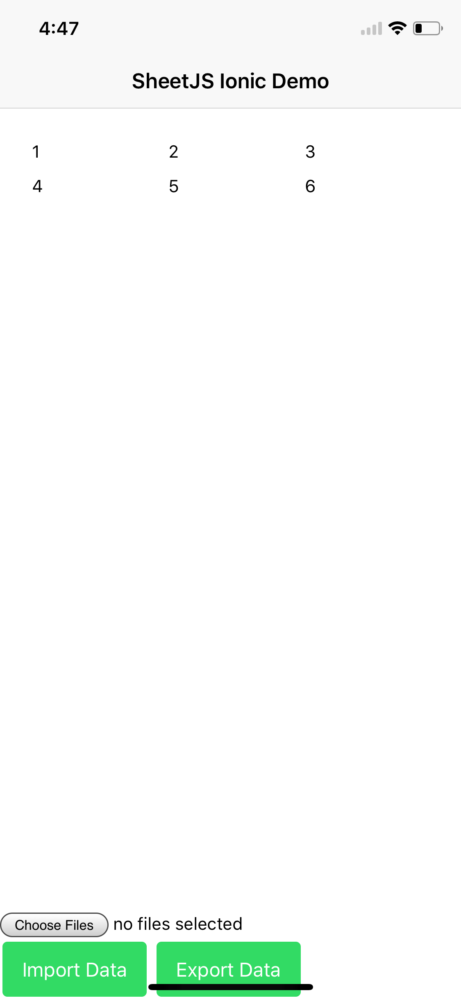

# Angular 2+

The library can be imported directly from TS code with:

```typescript
import * as XLSX from 'xlsx';
```

This demo uses an array of arrays (type `Array<Array<any>>`) as the core state.
The component template includes a file input element, a table that updates with
the data, and a button to export the data.

Other scripts in this demo show:
- `ionic` deployment for iOS, android, and browser
- `nativescript` deployment for iOS and android

## Array of Arrays

`Array<Array<any>>` neatly maps to a table with `ngFor`:

```html
<table class="sjs-table">
  <tr *ngFor="let row of data">
    <td *ngFor="let val of row">
      {{val}}
    </td>
  </tr>
</table>
```

The `aoa_to_sheet` utility function returns a worksheet.  Exporting is simple:

```typescript
/* generate worksheet */
const ws: XLSX.WorkSheet = XLSX.utils.aoa_to_sheet(this.data);

/* generate workbook and add the worksheet */
const wb: XLSX.WorkBook = XLSX.utils.book_new();
XLSX.utils.book_append_sheet(wb, ws, 'Sheet1');

/* save to file */
XLSX.writeFile(wb, 'SheetJS.xlsx');
```

`sheet_to_json` with the option `header:1` makes importing simple:

```typescript
/* <input type="file" (change)="onFileChange($event)" multiple="false" /> */
/* ... (within the component class definition) ... */
  onFileChange(evt: any) {
    /* wire up file reader */
    const target: DataTransfer = <DataTransfer>(evt.target);
    if (target.files.length !== 1) throw new Error('Cannot use multiple files');
    const reader: FileReader = new FileReader();
    reader.onload = (e: any) => {
      /* read workbook */
      const bstr: string = e.target.result;
      const wb: XLSX.WorkBook = XLSX.read(bstr, {type: 'binary'});

      /* grab first sheet */
      const wsname: string = wb.SheetNames[0];
      const ws: XLSX.WorkSheet = wb.Sheets[wsname];

      /* save data */
      this.data = <AOA>(XLSX.utils.sheet_to_json(ws, {header: 1}));
    };
    reader.readAsBinaryString(target.files[0]);
  }
```

## Switching between Angular versions

Modules that work with Angular 2 largely work as-is with Angular 4+.  Switching
between versions is mostly a matter of installing the correct version of the
core and associated modules.  This demo includes `package.json-angular#` files
for Angular 2, Angular 4, and Angular 5

To test a particular Angular version, overwrite `package.json`:

```bash
# switch to Angular 2
$ cp package.json-angular2 package.json
$ npm install
$ ng serve
```

## XLSX Symbolic Link

In this tree, `node_modules/xlsx` is a link pointing back to the root.  This
enables testing the development version of the library.  In order to use this
demo in other applications, add the `xlsx` dependency:

```bash
$ npm install --save xlsx
```

## SystemJS Configuration

The default angular-cli configuration requires no additional configuration.

Some deployments use the SystemJS loader, which does require configuration.  The
SystemJS example shows the required meta and map settings:

```js
SystemJS.config({
  meta: {
    'xlsx': {
      exports: 'XLSX' // <-- tell SystemJS to expose the XLSX variable
    }
  },
  map: {
    'xlsx': 'xlsx.full.min.js', // <-- make sure xlsx.full.min.js is in same dir
    'fs': '',     // <--|
    'crypto': '', // <--| suppress native node modules
    'stream': ''  // <--|
  }
});
```

## Ionic



Reproducing the full project is a little bit tricky.  The included `ionic.sh`
script performs the necessary installation steps.

`Array<Array<any>>` neatly maps to a table with `ngFor`:

```html
<ion-grid>
  <ion-row *ngFor="let row of data">
    <ion-col *ngFor="let val of row">
      {{val}}
    </ion-col>
  </ion-row>
</ion-grid>
```


`@ionic-native/file` reads and writes files on devices. `readAsBinaryString`
returns strings that can be parsed with the `binary` type, and `array` type can
easily be converted to blobs that can be exported with `writeFile`:

```typescript
/* read a workbook */
const bstr: string = await this.file.readAsBinaryString(url, filename);
const wb: XLSX.WorkBook = XLSX.read(bstr, {type: 'binary'});

/* write a workbook */
const wbout: ArrayBuffer = XLSX.write(wb, { bookType: 'xlsx', type: 'array' });
let blob = new Blob([wbout], {type: 'application/octet-stream'});
this.file.writeFile(url, filename, blob, {replace: true});
```

## NativeScript

Reproducing the full project is a little bit tricky.  The included `nscript.sh`
script performs the necessary installation steps and adds the necessary shims
for `async` support.  Due to incompatibilities with NativeScript and TypeScript
definitions, apps should require the `xlsx.full.min.js` file directly:

```typescript
const XLSX = require("./xlsx.full.min.js");
```

The `ISO_8859_1` encoding from the text module specifies `"binary"` strings.
`fs.File#readText` and `fs.File#writeText` reads and writes files:

```typescript
/* read a workbook */
const bstr: string = await file.readText(textModule.encoding.ISO_8859_1);
const wb = XLSX.read(bstr, { type: "binary" });

/* write a workbook */
const wbout: string = XLSX.write(wb, { bookType: 'xlsx', type: 'binary' });
await file.writeText(wbout, textModule.encoding.ISO_8859_1);
```

[](https://github.com/SheetJS/js-xlsx)
