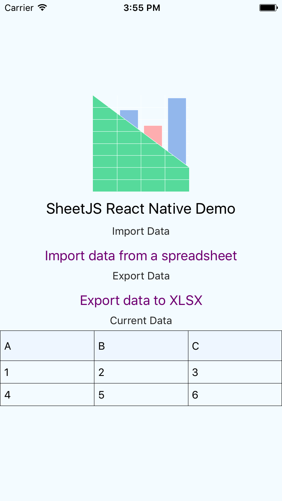

# React

The `xlsx.core.min.js` and `xlsx.full.min.js` scripts are designed to be dropped
into web pages with script tags e.g.

```html
<script src="xlsx.full.min.js"></script>
```

The library can also be imported directly from JSX code with:

```js
import * as XLSX from 'xlsx';
```

This demo shows a simple JSX component transpiled in the browser using the babel
standalone library.  Since there is no standard React table model, this demo
settles on the array of arrays approach.

Other scripts in this demo show:
- server-rendered React component (with `next.js`)
- `preact` using the react compatibility library
- `react-native` deployment for iOS and android

## Internal State

The simplest state representation is an array of arrays.  To avoid having the
table component depend on the library, the column labels are precomputed.  The
state in this demo is shaped like the following object:

```js
{
  cols: [
    { name: "A", key: 0 },
    { name: "B", key: 1 },
    { name: "C", key: 2 },
  ],
  data: [
    [ "id",    "name", "value" ],
    [    1, "sheetjs",    7262 ]
    [    2, "js-xlsx",    6969 ]
  ]
}
```

The appropriate state model is application-specific.

## React Native



Reproducing the full project is straightforward:

```bash
react-native init SheetJS
cd SheetJS
npm i -S xlsx react react-native react-native-table-component react-native-fs
cp ../react-native.js index.ios.js
cp ../react-native.js index.android.js
react-native link
```

This uses `react-native-fs` to read and write files on devices.  The app will
prompt before reading and after writing data.  The printed location will be:

- android: path in the device filesystem
- iOS simulator: local path to file
- iOS device: a path accessible from iTunes App Documents view
